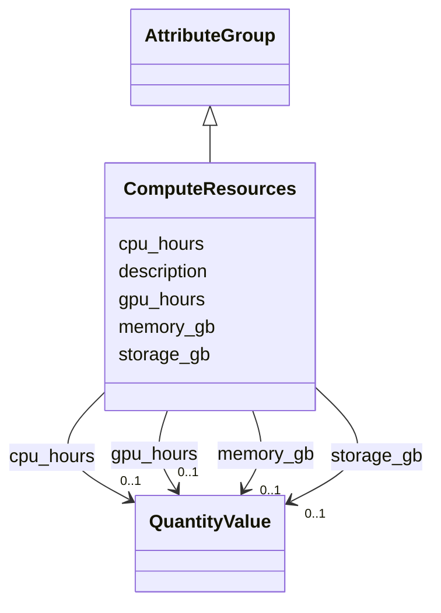

# Class: ComputeResources 


_Computational resources used_


URI: [aimsleaf:ComputeResources](https://w3id.org/aims-leaf/ComputeResources)





## Inheritance
* [AttributeGroup](AttributeGroup.md)
    * **ComputeResources**


## Slots

| Name | Cardinality and Range | Description | Inheritance |
| ---  | --- | --- | --- |
| [cpu_hours](cpu_hours.md) | 0..1 <br/> [QuantityValue](QuantityValue.md) | CPU hours used, measured in hours | direct |
| [gpu_hours](gpu_hours.md) | 0..1 <br/> [QuantityValue](QuantityValue.md) | GPU hours used, measured in hours | direct |
| [memory_gb](memory_gb.md) | 0..1 <br/> [QuantityValue](QuantityValue.md) | Maximum memory used, typically specified in gigabytes (GB) | direct |
| [storage_gb](storage_gb.md) | 0..1 <br/> [QuantityValue](QuantityValue.md) | Storage used, typically specified in gigabytes (GB) | direct |
| [description](description.md) | 0..1 <br/> [String](String.md) |  | [AttributeGroup](AttributeGroup.md) |


## Identifier and Mapping Information


### Schema Source


* from schema: https://w3id.org/aims-leaf/


## Mappings

| Mapping Type | Mapped Value |
| ---  | ---  |
| self | aimsleaf:ComputeResources |
| native | aimsleaf:ComputeResources |


## LinkML Source

<!-- TODO: investigate https://stackoverflow.com/questions/37606292/how-to-create-tabbed-code-blocks-in-mkdocs-or-sphinx -->

### Direct

<details>
```yaml
name: ComputeResources
description: Computational resources used
from_schema: https://w3id.org/aims-leaf/
is_a: AttributeGroup
attributes:
  cpu_hours:
    name: cpu_hours
    description: CPU hours used, measured in hours. Data providers may specify alternative
      time units by including the unit in the QuantityValue.
    from_schema: https://w3id.org/aims-leaf/
    rank: 1000
    domain_of:
    - ComputeResources
    range: QuantityValue
    inlined: true
  gpu_hours:
    name: gpu_hours
    description: GPU hours used, measured in hours. Data providers may specify alternative
      time units by including the unit in the QuantityValue.
    from_schema: https://w3id.org/aims-leaf/
    rank: 1000
    domain_of:
    - ComputeResources
    range: QuantityValue
    inlined: true
  memory_gb:
    name: memory_gb
    description: Maximum memory used, typically specified in gigabytes (GB). Data
      providers may specify alternative units by including the unit in the QuantityValue.
    from_schema: https://w3id.org/aims-leaf/
    rank: 1000
    domain_of:
    - ComputeResources
    range: QuantityValue
    inlined: true
  storage_gb:
    name: storage_gb
    description: Storage used, typically specified in gigabytes (GB). Data providers
      may specify alternative units by including the unit in the QuantityValue.
    from_schema: https://w3id.org/aims-leaf/
    rank: 1000
    domain_of:
    - ComputeResources
    range: QuantityValue
    inlined: true

```
</details>

### Induced

<details>
```yaml
name: ComputeResources
description: Computational resources used
from_schema: https://w3id.org/aims-leaf/
is_a: AttributeGroup
attributes:
  cpu_hours:
    name: cpu_hours
    description: CPU hours used, measured in hours. Data providers may specify alternative
      time units by including the unit in the QuantityValue.
    from_schema: https://w3id.org/aims-leaf/
    rank: 1000
    alias: cpu_hours
    owner: ComputeResources
    domain_of:
    - ComputeResources
    range: QuantityValue
    inlined: true
  gpu_hours:
    name: gpu_hours
    description: GPU hours used, measured in hours. Data providers may specify alternative
      time units by including the unit in the QuantityValue.
    from_schema: https://w3id.org/aims-leaf/
    rank: 1000
    alias: gpu_hours
    owner: ComputeResources
    domain_of:
    - ComputeResources
    range: QuantityValue
    inlined: true
  memory_gb:
    name: memory_gb
    description: Maximum memory used, typically specified in gigabytes (GB). Data
      providers may specify alternative units by including the unit in the QuantityValue.
    from_schema: https://w3id.org/aims-leaf/
    rank: 1000
    alias: memory_gb
    owner: ComputeResources
    domain_of:
    - ComputeResources
    range: QuantityValue
    inlined: true
  storage_gb:
    name: storage_gb
    description: Storage used, typically specified in gigabytes (GB). Data providers
      may specify alternative units by including the unit in the QuantityValue.
    from_schema: https://w3id.org/aims-leaf/
    rank: 1000
    alias: storage_gb
    owner: ComputeResources
    domain_of:
    - ComputeResources
    range: QuantityValue
    inlined: true
  description:
    name: description
    from_schema: https://w3id.org/aims-leaf/
    alias: description
    owner: ComputeResources
    domain_of:
    - NamedThing
    - AttributeGroup
    range: string

```
</details>