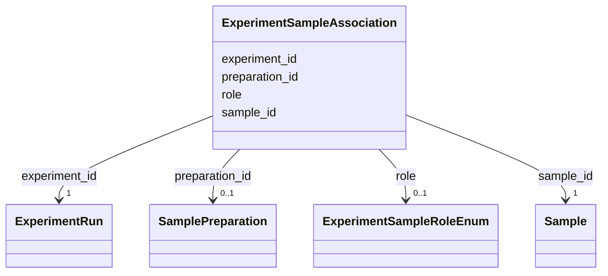

# Class: ExperimentSampleAssociation 


_M:N link between ExperimentRun and Sample with role metadata_


URI: [aimsleaf:ExperimentSampleAssociation](https://w3id.org/aims-leaf/ExperimentSampleAssociation)





<!-- no inheritance hierarchy -->


## Slots

| Name | Cardinality and Range | Description | Inheritance |
| ---  | --- | --- | --- |
| [experiment_id](experiment_id.md) | 1 <br/> [ExperimentRun](ExperimentRun.md) | Reference to the experiment run | direct |
| [sample_id](sample_id.md) | 1 <br/> [Sample](Sample.md) | Reference to the sample | direct |
| [role](role.md) | 0..1 <br/> [ExperimentSampleRoleEnum](ExperimentSampleRoleEnum.md) | Role of sample in experiment | direct |
| [preparation_id](preparation_id.md) | 0..1 <br/> [SamplePreparation](SamplePreparation.md) | Specific preparation used for this sample in this experiment | direct |


## Usages

| used by | used in | type | used |
| ---  | --- | --- | --- |
| [Dataset](Dataset.md) | [experiment_sample_associations](experiment_sample_associations.md) | range | [ExperimentSampleAssociation](ExperimentSampleAssociation.md) |


## Identifier and Mapping Information


### Schema Source


* from schema: https://w3id.org/aims-leaf/


## Mappings

| Mapping Type | Mapped Value |
| ---  | ---  |
| self | aimsleaf:ExperimentSampleAssociation |
| native | aimsleaf:ExperimentSampleAssociation |


## LinkML Source

<!-- TODO: investigate https://stackoverflow.com/questions/37606292/how-to-create-tabbed-code-blocks-in-mkdocs-or-sphinx -->

### Direct

<details>
```yaml
name: ExperimentSampleAssociation
description: M:N link between ExperimentRun and Sample with role metadata
from_schema: https://w3id.org/aims-leaf/
attributes:
  experiment_id:
    name: experiment_id
    description: Reference to the experiment run
    from_schema: https://w3id.org/aims-leaf/
    domain_of:
    - StudyExperimentAssociation
    - ExperimentSampleAssociation
    - ExperimentInstrumentAssociation
    - WorkflowExperimentAssociation
    range: ExperimentRun
    required: true
  sample_id:
    name: sample_id
    description: Reference to the sample
    from_schema: https://w3id.org/aims-leaf/
    domain_of:
    - SamplePreparation
    - StudySampleAssociation
    - SampleDataAssociation
    - ExperimentSampleAssociation
    range: Sample
    required: true
  role:
    name: role
    description: Role of sample in experiment
    from_schema: https://w3id.org/aims-leaf/
    domain_of:
    - StudySampleAssociation
    - SampleDataAssociation
    - ExperimentSampleAssociation
    - ExperimentInstrumentAssociation
    range: ExperimentSampleRoleEnum
  preparation_id:
    name: preparation_id
    description: Specific preparation used for this sample in this experiment
    from_schema: https://w3id.org/aims-leaf/
    rank: 1000
    domain_of:
    - ExperimentSampleAssociation
    range: SamplePreparation

```
</details>

### Induced

<details>
```yaml
name: ExperimentSampleAssociation
description: M:N link between ExperimentRun and Sample with role metadata
from_schema: https://w3id.org/aims-leaf/
attributes:
  experiment_id:
    name: experiment_id
    description: Reference to the experiment run
    from_schema: https://w3id.org/aims-leaf/
    alias: experiment_id
    owner: ExperimentSampleAssociation
    domain_of:
    - StudyExperimentAssociation
    - ExperimentSampleAssociation
    - ExperimentInstrumentAssociation
    - WorkflowExperimentAssociation
    range: ExperimentRun
    required: true
  sample_id:
    name: sample_id
    description: Reference to the sample
    from_schema: https://w3id.org/aims-leaf/
    alias: sample_id
    owner: ExperimentSampleAssociation
    domain_of:
    - SamplePreparation
    - StudySampleAssociation
    - SampleDataAssociation
    - ExperimentSampleAssociation
    range: Sample
    required: true
  role:
    name: role
    description: Role of sample in experiment
    from_schema: https://w3id.org/aims-leaf/
    alias: role
    owner: ExperimentSampleAssociation
    domain_of:
    - StudySampleAssociation
    - SampleDataAssociation
    - ExperimentSampleAssociation
    - ExperimentInstrumentAssociation
    range: ExperimentSampleRoleEnum
  preparation_id:
    name: preparation_id
    description: Specific preparation used for this sample in this experiment
    from_schema: https://w3id.org/aims-leaf/
    rank: 1000
    alias: preparation_id
    owner: ExperimentSampleAssociation
    domain_of:
    - ExperimentSampleAssociation
    range: SamplePreparation

```
</details>