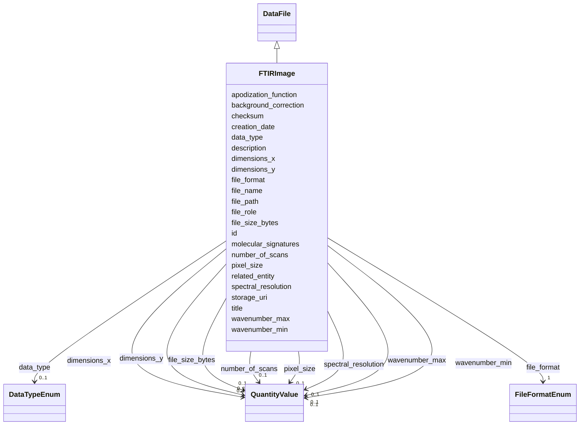

# Class: FTIRImage 


_Fourier Transform Infrared (FTIR) spectroscopy image capturing molecular composition through vibrational spectroscopy_


URI: [aimsleaf:FTIRImage](https://w3id.org/aims-leaf/FTIRImage)





## Inheritance
* [NamedThing](NamedThing.md)
    * [DataFile](DataFile.md)
        * **FTIRImage**


## Slots

| Name | Cardinality and Range | Description | Inheritance |
| ---  | --- | --- | --- |
| [pixel_size](pixel_size.md) | 0..1 <br/> [QuantityValue](QuantityValue.md) | Pixel size, typically specified in Angstroms | direct |
| [dimensions_x](dimensions_x.md) | 0..1 <br/> [QuantityValue](QuantityValue.md) | Image width, typically specified in pixels | direct |
| [dimensions_y](dimensions_y.md) | 0..1 <br/> [QuantityValue](QuantityValue.md) | Image height, typically specified in pixels | direct |
| [wavenumber_min](wavenumber_min.md) | 0..1 <br/> [QuantityValue](QuantityValue.md) | Minimum wavenumber, typically specified in inverse centimeters (cm⁻¹) | direct |
| [wavenumber_max](wavenumber_max.md) | 0..1 <br/> [QuantityValue](QuantityValue.md) | Maximum wavenumber, typically specified in inverse centimeters (cm⁻¹) | direct |
| [spectral_resolution](spectral_resolution.md) | 0..1 <br/> [QuantityValue](QuantityValue.md) | Spectral resolution, typically specified in inverse centimeters (cm⁻¹) | direct |
| [number_of_scans](number_of_scans.md) | 0..1 <br/> [QuantityValue](QuantityValue.md) | Number of scans averaged for the spectrum | direct |
| [apodization_function](apodization_function.md) | 0..1 <br/> [String](String.md) | Mathematical function used for apodization | direct |
| [molecular_signatures](molecular_signatures.md) | * <br/> [String](String.md) | Identified molecular signatures or peaks | direct |
| [background_correction](background_correction.md) | 0..1 <br/> [String](String.md) | Method used for background correction | direct |
| [file_name](file_name.md) | 1 <br/> [String](String.md) | Name of the file | [DataFile](DataFile.md) |
| [file_path](file_path.md) | 0..1 <br/> [String](String.md) | Path to the file | [DataFile](DataFile.md) |
| [file_format](file_format.md) | 1 <br/> [FileFormatEnum](FileFormatEnum.md) | File format | [DataFile](DataFile.md) |
| [file_size_bytes](file_size_bytes.md) | 0..1 <br/> [QuantityValue](QuantityValue.md) | File size in bytes | [DataFile](DataFile.md) |
| [checksum](checksum.md) | 0..1 <br/> [String](String.md) | SHA-256 checksum for data integrity | [DataFile](DataFile.md) |
| [creation_date](creation_date.md) | 0..1 <br/> [Date](Date.md) | File creation date | [DataFile](DataFile.md) |
| [data_type](data_type.md) | 0..1 <br/> [DataTypeEnum](DataTypeEnum.md) | Type of data in the file | [DataFile](DataFile.md) |
| [storage_uri](storage_uri.md) | 0..1 <br/> [String](String.md) | Storage URI (S3, Globus, etc | [DataFile](DataFile.md) |
| [related_entity](related_entity.md) | 0..1 <br/> [String](String.md) | ID of the entity that owns this file | [DataFile](DataFile.md) |
| [file_role](file_role.md) | 0..1 <br/> [String](String.md) | Role of the file (raw, intermediate, final, diagnostic, metadata) | [DataFile](DataFile.md) |
| [id](id.md) | 1 <br/> [Uriorcurie](Uriorcurie.md) | Globally unique identifier as an IRI or CURIE for machine processing and exte... | [NamedThing](NamedThing.md) |
| [title](title.md) | 0..1 <br/> [String](String.md) | A human-readable name or title for this entity | [NamedThing](NamedThing.md) |
| [description](description.md) | 0..1 <br/> [String](String.md) | A detailed textual description of this entity | [NamedThing](NamedThing.md) |


## Identifier and Mapping Information


### Schema Source


* from schema: https://w3id.org/aims-leaf/


## Mappings

| Mapping Type | Mapped Value |
| ---  | ---  |
| self | aimsleaf:FTIRImage |
| native | aimsleaf:FTIRImage |


## LinkML Source

<!-- TODO: investigate https://stackoverflow.com/questions/37606292/how-to-create-tabbed-code-blocks-in-mkdocs-or-sphinx -->

### Direct

<details>
```yaml
name: FTIRImage
description: Fourier Transform Infrared (FTIR) spectroscopy image capturing molecular
  composition through vibrational spectroscopy
from_schema: https://w3id.org/aims-leaf/
is_a: DataFile
attributes:
  pixel_size:
    name: pixel_size
    description: Pixel size, typically specified in Angstroms. Data providers may
      specify alternative units by including the unit in the QuantityValue.
    from_schema: https://w3id.org/aims-leaf/
    domain_of:
    - Image
    - FTIRImage
    - XRFImage
    - RefinementParameters
    range: QuantityValue
    inlined: true
  dimensions_x:
    name: dimensions_x
    description: Image width, typically specified in pixels. Data providers may specify
      alternative units by including the unit in the QuantityValue.
    from_schema: https://w3id.org/aims-leaf/
    domain_of:
    - Image
    - FTIRImage
    - XRFImage
    range: QuantityValue
    inlined: true
  dimensions_y:
    name: dimensions_y
    description: Image height, typically specified in pixels. Data providers may specify
      alternative units by including the unit in the QuantityValue.
    from_schema: https://w3id.org/aims-leaf/
    domain_of:
    - Image
    - FTIRImage
    - XRFImage
    range: QuantityValue
    inlined: true
  wavenumber_min:
    name: wavenumber_min
    description: Minimum wavenumber, typically specified in inverse centimeters (cm⁻¹).
      Data providers may specify alternative units by including the unit in the QuantityValue.
    from_schema: https://w3id.org/aims-leaf/
    rank: 1000
    domain_of:
    - FTIRImage
    range: QuantityValue
    inlined: true
  wavenumber_max:
    name: wavenumber_max
    description: Maximum wavenumber, typically specified in inverse centimeters (cm⁻¹).
      Data providers may specify alternative units by including the unit in the QuantityValue.
    from_schema: https://w3id.org/aims-leaf/
    rank: 1000
    domain_of:
    - FTIRImage
    range: QuantityValue
    inlined: true
  spectral_resolution:
    name: spectral_resolution
    description: Spectral resolution, typically specified in inverse centimeters (cm⁻¹).
      Data providers may specify alternative units by including the unit in the QuantityValue.
    from_schema: https://w3id.org/aims-leaf/
    rank: 1000
    domain_of:
    - FTIRImage
    range: QuantityValue
    inlined: true
  number_of_scans:
    name: number_of_scans
    description: Number of scans averaged for the spectrum
    from_schema: https://w3id.org/aims-leaf/
    rank: 1000
    domain_of:
    - FTIRImage
    range: QuantityValue
    inlined: true
  apodization_function:
    name: apodization_function
    description: Mathematical function used for apodization
    from_schema: https://w3id.org/aims-leaf/
    rank: 1000
    domain_of:
    - FTIRImage
    range: string
  molecular_signatures:
    name: molecular_signatures
    description: Identified molecular signatures or peaks
    from_schema: https://w3id.org/aims-leaf/
    rank: 1000
    domain_of:
    - FTIRImage
    range: string
    multivalued: true
  background_correction:
    name: background_correction
    description: Method used for background correction
    from_schema: https://w3id.org/aims-leaf/
    rank: 1000
    domain_of:
    - FTIRImage
    range: string

```
</details>

### Induced

<details>
```yaml
name: FTIRImage
description: Fourier Transform Infrared (FTIR) spectroscopy image capturing molecular
  composition through vibrational spectroscopy
from_schema: https://w3id.org/aims-leaf/
is_a: DataFile
attributes:
  pixel_size:
    name: pixel_size
    description: Pixel size, typically specified in Angstroms. Data providers may
      specify alternative units by including the unit in the QuantityValue.
    from_schema: https://w3id.org/aims-leaf/
    alias: pixel_size
    owner: FTIRImage
    domain_of:
    - Image
    - FTIRImage
    - XRFImage
    - RefinementParameters
    range: QuantityValue
    inlined: true
  dimensions_x:
    name: dimensions_x
    description: Image width, typically specified in pixels. Data providers may specify
      alternative units by including the unit in the QuantityValue.
    from_schema: https://w3id.org/aims-leaf/
    alias: dimensions_x
    owner: FTIRImage
    domain_of:
    - Image
    - FTIRImage
    - XRFImage
    range: QuantityValue
    inlined: true
  dimensions_y:
    name: dimensions_y
    description: Image height, typically specified in pixels. Data providers may specify
      alternative units by including the unit in the QuantityValue.
    from_schema: https://w3id.org/aims-leaf/
    alias: dimensions_y
    owner: FTIRImage
    domain_of:
    - Image
    - FTIRImage
    - XRFImage
    range: QuantityValue
    inlined: true
  wavenumber_min:
    name: wavenumber_min
    description: Minimum wavenumber, typically specified in inverse centimeters (cm⁻¹).
      Data providers may specify alternative units by including the unit in the QuantityValue.
    from_schema: https://w3id.org/aims-leaf/
    rank: 1000
    alias: wavenumber_min
    owner: FTIRImage
    domain_of:
    - FTIRImage
    range: QuantityValue
    inlined: true
  wavenumber_max:
    name: wavenumber_max
    description: Maximum wavenumber, typically specified in inverse centimeters (cm⁻¹).
      Data providers may specify alternative units by including the unit in the QuantityValue.
    from_schema: https://w3id.org/aims-leaf/
    rank: 1000
    alias: wavenumber_max
    owner: FTIRImage
    domain_of:
    - FTIRImage
    range: QuantityValue
    inlined: true
  spectral_resolution:
    name: spectral_resolution
    description: Spectral resolution, typically specified in inverse centimeters (cm⁻¹).
      Data providers may specify alternative units by including the unit in the QuantityValue.
    from_schema: https://w3id.org/aims-leaf/
    rank: 1000
    alias: spectral_resolution
    owner: FTIRImage
    domain_of:
    - FTIRImage
    range: QuantityValue
    inlined: true
  number_of_scans:
    name: number_of_scans
    description: Number of scans averaged for the spectrum
    from_schema: https://w3id.org/aims-leaf/
    rank: 1000
    alias: number_of_scans
    owner: FTIRImage
    domain_of:
    - FTIRImage
    range: QuantityValue
    inlined: true
  apodization_function:
    name: apodization_function
    description: Mathematical function used for apodization
    from_schema: https://w3id.org/aims-leaf/
    rank: 1000
    alias: apodization_function
    owner: FTIRImage
    domain_of:
    - FTIRImage
    range: string
  molecular_signatures:
    name: molecular_signatures
    description: Identified molecular signatures or peaks
    from_schema: https://w3id.org/aims-leaf/
    rank: 1000
    alias: molecular_signatures
    owner: FTIRImage
    domain_of:
    - FTIRImage
    range: string
    multivalued: true
  background_correction:
    name: background_correction
    description: Method used for background correction
    from_schema: https://w3id.org/aims-leaf/
    rank: 1000
    alias: background_correction
    owner: FTIRImage
    domain_of:
    - FTIRImage
    range: string
  file_name:
    name: file_name
    description: Name of the file
    from_schema: https://w3id.org/aims-leaf/
    rank: 1000
    alias: file_name
    owner: FTIRImage
    domain_of:
    - DataFile
    - Image
    range: string
    required: true
  file_path:
    name: file_path
    description: Path to the file
    from_schema: https://w3id.org/aims-leaf/
    rank: 1000
    alias: file_path
    owner: FTIRImage
    domain_of:
    - DataFile
    range: string
  file_format:
    name: file_format
    description: File format
    from_schema: https://w3id.org/aims-leaf/
    rank: 1000
    alias: file_format
    owner: FTIRImage
    domain_of:
    - DataFile
    range: FileFormatEnum
    required: true
  file_size_bytes:
    name: file_size_bytes
    description: File size in bytes
    from_schema: https://w3id.org/aims-leaf/
    rank: 1000
    alias: file_size_bytes
    owner: FTIRImage
    domain_of:
    - DataFile
    range: QuantityValue
    inlined: true
  checksum:
    name: checksum
    description: SHA-256 checksum for data integrity
    from_schema: https://w3id.org/aims-leaf/
    rank: 1000
    alias: checksum
    owner: FTIRImage
    domain_of:
    - DataFile
    range: string
  creation_date:
    name: creation_date
    description: File creation date
    from_schema: https://w3id.org/aims-leaf/
    rank: 1000
    alias: creation_date
    owner: FTIRImage
    domain_of:
    - DataFile
    range: date
  data_type:
    name: data_type
    description: Type of data in the file
    from_schema: https://w3id.org/aims-leaf/
    rank: 1000
    alias: data_type
    owner: FTIRImage
    domain_of:
    - DataFile
    range: DataTypeEnum
  storage_uri:
    name: storage_uri
    description: Storage URI (S3, Globus, etc.)
    from_schema: https://w3id.org/aims-leaf/
    rank: 1000
    alias: storage_uri
    owner: FTIRImage
    domain_of:
    - DataFile
    range: string
  related_entity:
    name: related_entity
    description: ID of the entity that owns this file
    from_schema: https://w3id.org/aims-leaf/
    rank: 1000
    alias: related_entity
    owner: FTIRImage
    domain_of:
    - DataFile
    range: string
  file_role:
    name: file_role
    description: Role of the file (raw, intermediate, final, diagnostic, metadata)
    from_schema: https://w3id.org/aims-leaf/
    rank: 1000
    alias: file_role
    owner: FTIRImage
    domain_of:
    - DataFile
    range: string
  id:
    name: id
    description: Globally unique identifier as an IRI or CURIE for machine processing
      and external references. Used for linking data across systems and semantic web
      integration.
    from_schema: https://w3id.org/aims-leaf/
    rank: 1000
    identifier: true
    alias: id
    owner: FTIRImage
    domain_of:
    - NamedThing
    - Attribute
    range: uriorcurie
    required: true
  title:
    name: title
    description: A human-readable name or title for this entity
    from_schema: https://w3id.org/aims-leaf/
    rank: 1000
    slot_uri: dcterms:title
    alias: title
    owner: FTIRImage
    domain_of:
    - NamedThing
    range: string
  description:
    name: description
    description: A detailed textual description of this entity
    from_schema: https://w3id.org/aims-leaf/
    rank: 1000
    alias: description
    owner: FTIRImage
    domain_of:
    - NamedThing
    - AttributeGroup
    range: string

```
</details>