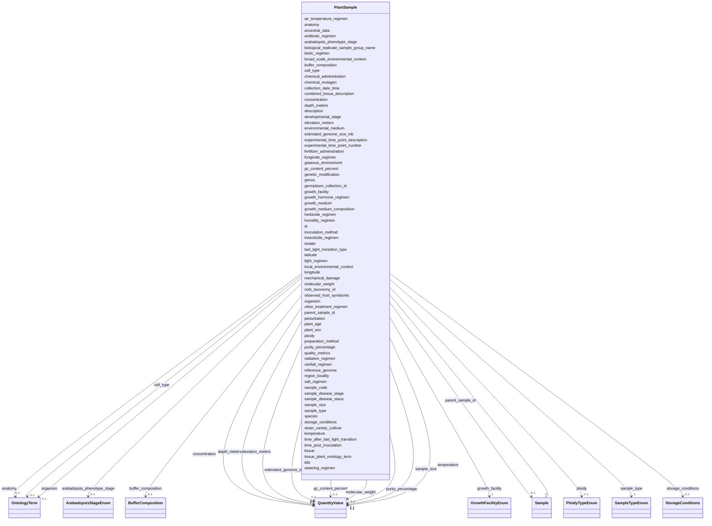

# Class: PlantSample 


_Plant sample info for AIMS-LEAF_


URI: [aimsleaf:PlantSample](https://w3id.org/aims-leaf/PlantSample)





## Inheritance
* [NamedThing](NamedThing.md)
    * [Sample](Sample.md)
        * **PlantSample**


## Slots

| Name | Cardinality and Range | Description | Inheritance |
| ---  | --- | --- | --- |
| [biological_replicate_sample_group_name](biological_replicate_sample_group_name.md) | 0..1 <br/> [String](String.md) | Samples that are biological replicates should have the same group name | direct |
| [combined_tissue_description](combined_tissue_description.md) | 0..1 <br/> [String](String.md) | The number and relationship between the tissues if multiple tissue samples we... | direct |
| [experimental_time_point_number](experimental_time_point_number.md) | 0..1 <br/> [Integer](Integer.md) | Integer number representing the sequential numbering of time points, applicab... | direct |
| [experimental_time_point_description](experimental_time_point_description.md) | 0..1 <br/> [String](String.md) | Description of the time point sampled, applicable to samples that are part of... | direct |
| [genus](genus.md) | 1 <br/> [String](String.md) |  | direct |
| [species](species.md) | 1 <br/> [String](String.md) |  | direct |
| [strain_variety_cultivar](strain_variety_cultivar.md) | 0..1 <br/> [String](String.md) | Name or ID of the cultivar, variety, strain, or other similar designation of ... | direct |
| [isolate](isolate.md) | 0..1 <br/> [String](String.md) | Isolate or mutant name | direct |
| [germplasm_collection_id](germplasm_collection_id.md) | 0..1 <br/> [String](String.md) | Culture collection name and ID from which the original plant germplasm was so... | direct |
| [ncbi_taxonomy_id](ncbi_taxonomy_id.md) | 0..1 <br/> [Integer](Integer.md) | Unique identifier from the NCBI taxonomy database | direct |
| [ancestral_data](ancestral_data.md) | 0..1 <br/> [String](String.md) | Information about either pedigree or other description of ancestral informati... | direct |
| [genetic_modification](genetic_modification.md) | 0..1 <br/> [String](String.md) | Genetic modifications of the genome of an organism, which may occur naturally... | direct |
| [estimated_genome_size_mb](estimated_genome_size_mb.md) | 0..1 <br/> [QuantityValue](QuantityValue.md) | Estimated genome size of the primary species being sampled, between 1-100000 | direct |
| [gc_content_percent](gc_content_percent.md) | 0..1 <br/> [QuantityValue](QuantityValue.md) | Estimated GC content of the genome of the primary species being sampled, nume... | direct |
| [ploidy](ploidy.md) | 0..1 <br/> [PloidyTypeEnum](PloidyTypeEnum.md) | The ploidy level of the genome | direct |
| [reference_genome](reference_genome.md) | 0..1 <br/> [String](String.md) | Reference genome and annotation to be used for analysis | direct |
| [collection_date_time](collection_date_time.md) | 1 <br/> [String](String.md) | The time of sampling, either as an instance (single point in time) or interva... | direct |
| [sample_size](sample_size.md) | 0..1 <br/> [QuantityValue](QuantityValue.md) | The total amount or size (volume (ml), mass (g) or area (m2)) of sample colle... | direct |
| [tissue](tissue.md) | 1 <br/> [String](String.md) | Detailed description of the organ or type of tissue sampled | direct |
| [tissue_plant_ontology_term](tissue_plant_ontology_term.md) | 0..1 <br/> [String](String.md) | Plant ontology term corresponding to plant structure sampled; see https://pla... | direct |
| [region_locality](region_locality.md) | 0..1 <br/> [String](String.md) | The geographical origin of the sample as defined by the country or sea name f... | direct |
| [latitude](latitude.md) | 0..1 <br/> [Float](Float.md) | The geographical origin of the sample as defined by latitude | direct |
| [longitude](longitude.md) | 0..1 <br/> [Float](Float.md) | The geographical origin of the sample as defined by longitude | direct |
| [depth_meters](depth_meters.md) | 0..1 <br/> [QuantityValue](QuantityValue.md) | The vertical distance (in meters) below local surface | direct |
| [elevation_meters](elevation_meters.md) | 0..1 <br/> [QuantityValue](QuantityValue.md) | Elevation (in meters) of the sampling site as measured by the vertical distan... | direct |
| [temperature](temperature.md) | 0..1 <br/> [QuantityValue](QuantityValue.md) | Temperature (in degrees Celsius) of the sample at time of sampling | direct |
| [broad_scale_environmental_context](broad_scale_environmental_context.md) | 0..1 <br/> [String](String.md) | The major environmental system the sample or specimen came from | direct |
| [local_environmental_context](local_environmental_context.md) | 0..1 <br/> [String](String.md) | The entity or entities which are in the sample or specimen's local vicinity a... | direct |
| [environmental_medium](environmental_medium.md) | 0..1 <br/> [String](String.md) | The environmental material(s) immediately surrounding the sample or specimen ... | direct |
| [growth_facility](growth_facility.md) | 1 <br/> [GrowthFacilityEnum](GrowthFacilityEnum.md) | Type of facility where the sampled plant was grown | direct |
| [growth_medium](growth_medium.md) | 1 <br/> [String](String.md) | General specification of the media for growing the plants or tissue cultured ... | direct |
| [growth_medium_composition](growth_medium_composition.md) | 0..1 <br/> [String](String.md) | Detailed description of the makeup of the plant growth medium | direct |
| [plant_age](plant_age.md) | 0..1 <br/> [String](String.md) | The age of the plant from which the tissue was sampled | direct |
| [developmental_stage](developmental_stage.md) | 1 <br/> [String](String.md) | The developmental stage of the plant from which the tissue was sampled | direct |
| [arabadopsis_phenotype_stage](arabadopsis_phenotype_stage.md) | 0..1 <br/> [ArabadopsisStageEnum](ArabadopsisStageEnum.md) | Stage that takes into account effect of genotype & environment effects | direct |
| [air_temperature_regimen](air_temperature_regimen.md) | 0..1 <br/> [String](String.md) | Information about treatment involving an exposure to varying temperatures | direct |
| [antibiotic_regimen](antibiotic_regimen.md) | 0..1 <br/> [String](String.md) | Information about treatment involving antibiotic administration | direct |
| [biotic_regimen](biotic_regimen.md) | 0..1 <br/> [String](String.md) | Information about treatment involving use of biotic factors, such as bacteria... | direct |
| [inoculation_method](inoculation_method.md) | 0..1 <br/> [String](String.md) | Method and material used for inoculation or infiltration with a biotic agent | direct |
| [time_post_inoculation](time_post_inoculation.md) | 0..1 <br/> [String](String.md) | The time between inoculation with the biotic agent and sample collection, spe... | direct |
| [chemical_administration](chemical_administration.md) | 0..1 <br/> [String](String.md) | List of chemical compounds administered to the host or site where sampling oc... | direct |
| [chemical_mutagen](chemical_mutagen.md) | 0..1 <br/> [String](String.md) | Treatment involving use of mutagens | direct |
| [fertilizer_administration](fertilizer_administration.md) | 0..1 <br/> [String](String.md) | Detailed description of fertilizer application | direct |
| [insecticide_regimen](insecticide_regimen.md) | 0..1 <br/> [String](String.md) | Information about treatment involving use of insecticides | direct |
| [fungicide_regimen](fungicide_regimen.md) | 0..1 <br/> [String](String.md) | Information about treatment involving use of fungicides | direct |
| [gaseous_environment](gaseous_environment.md) | 0..1 <br/> [String](String.md) | Use of conditions with differing gaseous environments | direct |
| [growth_hormone_regimen](growth_hormone_regimen.md) | 0..1 <br/> [String](String.md) | Information about treatment involving use of growth hormones | direct |
| [herbicide_regimen](herbicide_regimen.md) | 0..1 <br/> [String](String.md) | Information about treatment involving use of herbicides | direct |
| [humidity_regimen](humidity_regimen.md) | 0..1 <br/> [String](String.md) | Information about treatment involving an exposure to varying degree of humidi... | direct |
| [radiation_regimen](radiation_regimen.md) | 0..1 <br/> [String](String.md) | Information about treatment involving exposure of plant or a plant part to a ... | direct |
| [light_regimen](light_regimen.md) | 0..1 <br/> [String](String.md) | Information about treatment involving an exposure to light, including intensi... | direct |
| [last_light_transition_type](last_light_transition_type.md) | 0..1 <br/> [String](String.md) | The most recent light transition before sampling | direct |
| [time_after_last_light_transition](time_after_last_light_transition.md) | 0..1 <br/> [String](String.md) | The time between sampling and the most recent light transition, specified as ... | direct |
| [salt_regimen](salt_regimen.md) | 0..1 <br/> [String](String.md) | Information about treatment involving use of salts as supplement to liquid an... | direct |
| [rainfall_regimen](rainfall_regimen.md) | 0..1 <br/> [String](String.md) | Information about treatment involving an exposure to a given amount of rainfa... | direct |
| [watering_regimen](watering_regimen.md) | 0..1 <br/> [String](String.md) | Information about treatment involving an exposure to watering frequencies | direct |
| [other_treatment_regimen](other_treatment_regimen.md) | 0..1 <br/> [String](String.md) | Use this field to provide information about treatments that are not captured ... | direct |
| [perturbation](perturbation.md) | 0..1 <br/> [String](String.md) | Type of perturbation, e | direct |
| [mechanical_damage](mechanical_damage.md) | 0..1 <br/> [String](String.md) | Information about any mechanical damage exerted on the plant | direct |
| [observed_host_symbionts](observed_host_symbionts.md) | 0..1 <br/> [String](String.md) | The taxonomic name of the organism(s) found living in mutualistic, commensali... | direct |
| [plant_sex](plant_sex.md) | 0..1 <br/> [String](String.md) | Sex of the reproductive parts on the whole plant, e | direct |
| [sample_disease_staus](sample_disease_staus.md) | 0..1 <br/> [String](String.md) | List of diseases with which the subject has been diagnosed at the time of sam... | direct |
| [sample_disease_stage](sample_disease_stage.md) | 0..1 <br/> [String](String.md) | Stage of the disease at the time of sample collection, e | direct |
| [sample_code](sample_code.md) | 1 <br/> [String](String.md) | Human-friendly laboratory identifier or facility code for the sample (e | [Sample](Sample.md) |
| [sample_type](sample_type.md) | 1 <br/> [SampleTypeEnum](SampleTypeEnum.md) | Type of biological sample | [Sample](Sample.md) |
| [molecular_weight](molecular_weight.md) | 0..1 <br/> [QuantityValue](QuantityValue.md) | Molecular weight, typically specified in kilodaltons (kDa) | [Sample](Sample.md) |
| [concentration](concentration.md) | 0..1 <br/> [QuantityValue](QuantityValue.md) | Sample concentration, typically specified in mg/mL or µM | [Sample](Sample.md) |
| [buffer_composition](buffer_composition.md) | 0..1 <br/> [BufferComposition](BufferComposition.md) | Buffer composition including pH, salts, additives | [Sample](Sample.md) |
| [preparation_method](preparation_method.md) | 0..1 <br/> [String](String.md) | Method used to prepare the sample | [Sample](Sample.md) |
| [storage_conditions](storage_conditions.md) | 0..1 <br/> [StorageConditions](StorageConditions.md) | Storage conditions for the sample | [Sample](Sample.md) |
| [organism](organism.md) | 0..1 <br/> [OntologyTerm](OntologyTerm.md) | Source organism for the sample (e | [Sample](Sample.md) |
| [anatomy](anatomy.md) | 0..1 <br/> [OntologyTerm](OntologyTerm.md) | Anatomical part or tissue (e | [Sample](Sample.md) |
| [cell_type](cell_type.md) | 0..1 <br/> [OntologyTerm](OntologyTerm.md) | Cell type if applicable (e | [Sample](Sample.md) |
| [parent_sample_id](parent_sample_id.md) | 0..1 <br/> [Sample](Sample.md) | Reference to parent sample for derivation tracking | [Sample](Sample.md) |
| [purity_percentage](purity_percentage.md) | 0..1 <br/> [QuantityValue](QuantityValue.md) | Sample purity, typically specified as a percentage (range: 0-100) | [Sample](Sample.md) |
| [quality_metrics](quality_metrics.md) | 0..1 <br/> [String](String.md) | Quality control metrics for the sample | [Sample](Sample.md) |
| [id](id.md) | 1 <br/> [Uriorcurie](Uriorcurie.md) | Globally unique identifier as an IRI or CURIE for machine processing and exte... | [NamedThing](NamedThing.md) |
| [title](title.md) | 0..1 <br/> [String](String.md) | A human-readable name or title for this entity | [NamedThing](NamedThing.md) |
| [description](description.md) | 0..1 <br/> [String](String.md) | A detailed textual description of this entity | [NamedThing](NamedThing.md) |


## Usages

| used by | used in | type | used |
| ---  | --- | --- | --- |
| [Dataset](Dataset.md) | [plantsamples](plantsamples.md) | range | [PlantSample](PlantSample.md) |


## Identifier and Mapping Information


### Schema Source


* from schema: https://w3id.org/aims-leaf/


## Mappings

| Mapping Type | Mapped Value |
| ---  | ---  |
| self | aimsleaf:PlantSample |
| native | aimsleaf:PlantSample |


## LinkML Source

<!-- TODO: investigate https://stackoverflow.com/questions/37606292/how-to-create-tabbed-code-blocks-in-mkdocs-or-sphinx -->

### Direct

<details>
```yaml
name: PlantSample
description: Plant sample info for AIMS-LEAF
from_schema: https://w3id.org/aims-leaf/
is_a: Sample
attributes:
  biological_replicate_sample_group_name:
    name: biological_replicate_sample_group_name
    description: Samples that are biological replicates should have the same group
      name
    comments:
    - sbicolor_3d_root
    from_schema: https://w3id.org/aims-leaf/plant/
    rank: 1000
    domain_of:
    - PlantSample
    range: string
    required: false
  combined_tissue_description:
    name: combined_tissue_description
    description: The number and relationship between the tissues if multiple tissue
      samples were combined into a single container
    comments:
    - 6 lateral root tips from each of two plants
    from_schema: https://w3id.org/aims-leaf/plant/
    rank: 1000
    domain_of:
    - PlantSample
    range: string
    required: false
  experimental_time_point_number:
    name: experimental_time_point_number
    description: Integer number representing the sequential numbering of time points,
      applicable to samples that are part of time course experiments
    from_schema: https://w3id.org/aims-leaf/plant/
    rank: 1000
    domain_of:
    - PlantSample
    range: integer
    required: false
  experimental_time_point_description:
    name: experimental_time_point_description
    description: Description of the time point sampled, applicable to samples that
      are part of time course experiments
    comments:
    - 3 days post germination
    from_schema: https://w3id.org/aims-leaf/plant/
    rank: 1000
    domain_of:
    - PlantSample
    range: string
    required: false
  genus:
    name: genus
    from_schema: https://w3id.org/aims-leaf/plant/
    rank: 1000
    domain_of:
    - PlantSample
    range: string
    required: true
  species:
    name: species
    from_schema: https://w3id.org/aims-leaf/plant/
    rank: 1000
    domain_of:
    - PlantSample
    range: string
    required: true
  strain_variety_cultivar:
    name: strain_variety_cultivar
    description: Name or ID of the cultivar, variety, strain, or other similar designation
      of the primary organism being sampled
    comments:
    - RTx430
    from_schema: https://w3id.org/aims-leaf/plant/
    rank: 1000
    domain_of:
    - PlantSample
    range: string
    required: false
  isolate:
    name: isolate
    description: Isolate or mutant name
    comments:
    - Sb_Mut1
    from_schema: https://w3id.org/aims-leaf/plant/
    rank: 1000
    domain_of:
    - PlantSample
    range: string
    required: false
  germplasm_collection_id:
    name: germplasm_collection_id
    description: Culture collection name and ID from which the original plant germplasm
      was sourced
    comments:
    - ABRC CS22561
    from_schema: https://w3id.org/aims-leaf/plant/
    rank: 1000
    domain_of:
    - PlantSample
    range: string
    required: false
  ncbi_taxonomy_id:
    name: ncbi_taxonomy_id
    description: Unique identifier from the NCBI taxonomy database
    comments:
    - '4558'
    from_schema: https://w3id.org/aims-leaf/plant/
    rank: 1000
    domain_of:
    - PlantSample
    range: integer
    required: false
  ancestral_data:
    name: ancestral_data
    description: Information about either pedigree or other description of ancestral
      information
    comments:
    - Hybrid of A x B lines
    from_schema: https://w3id.org/aims-leaf/plant/
    rank: 1000
    domain_of:
    - PlantSample
    range: string
    required: false
  genetic_modification:
    name: genetic_modification
    description: Genetic modifications of the genome of an organism, which may occur
      naturally by spontaneous mutation, or be introduced by some experimental means
    comments:
    - mlo-11 allele
    from_schema: https://w3id.org/aims-leaf/plant/
    rank: 1000
    domain_of:
    - PlantSample
    range: string
    required: false
  estimated_genome_size_mb:
    name: estimated_genome_size_mb
    description: Estimated genome size of the primary species being sampled, between
      1-100000
    comments:
    - 730 Mb
    from_schema: https://w3id.org/aims-leaf/plant/
    rank: 1000
    domain_of:
    - PlantSample
    range: QuantityValue
    inlined: true
  gc_content_percent:
    name: gc_content_percent
    description: Estimated GC content of the genome of the primary species being sampled,
      numeric only
    comments:
    - 45 %
    from_schema: https://w3id.org/aims-leaf/plant/
    rank: 1000
    domain_of:
    - PlantSample
    range: QuantityValue
    inlined: true
  ploidy:
    name: ploidy
    description: The ploidy level of the genome. For terms, please select terms listed
      under class ploidy (PATO:001374) of Phenotypic Quality Ontology
    comments:
    - diploid
    from_schema: https://w3id.org/aims-leaf/plant/
    rank: 1000
    domain_of:
    - PlantSample
    range: PloidyTypeEnum
    required: false
  reference_genome:
    name: reference_genome
    description: Reference genome and annotation to be used for analysis
    comments:
    - Phytozome Sorghum bicolor RTx430 v2.1
    from_schema: https://w3id.org/aims-leaf/plant/
    rank: 1000
    domain_of:
    - PlantSample
    range: string
    required: false
  collection_date_time:
    name: collection_date_time
    description: The time of sampling, either as an instance (single point in time)
      or interval. All valid ISO8601 formats are acceptable
    comments:
    - '2025-08-10T14:00:00-07:00'
    from_schema: https://w3id.org/aims-leaf/plant/
    rank: 1000
    domain_of:
    - PlantSample
    range: string
    required: true
  sample_size:
    name: sample_size
    description: The total amount or size (volume (ml), mass (g) or area (m2)) of
      sample collected. Separate the number and unit by a single space
    comments:
    - 0.45 g
    from_schema: https://w3id.org/aims-leaf/plant/
    rank: 1000
    domain_of:
    - PlantSample
    range: QuantityValue
    required: false
    inlined: true
  tissue:
    name: tissue
    description: Detailed description of the organ or type of tissue sampled
    comments:
    - 5 mm lateral root tips
    from_schema: https://w3id.org/aims-leaf/plant/
    rank: 1000
    domain_of:
    - PlantSample
    range: string
    required: true
  tissue_plant_ontology_term:
    name: tissue_plant_ontology_term
    description: Plant ontology term corresponding to plant structure sampled; see
      https://planteome.org. May include multiple terms separated by semicolons
    comments:
    - seedling cotyledon (PO:0025471); seedling hypocotyl (PO:0025291)
    from_schema: https://w3id.org/aims-leaf/plant/
    rank: 1000
    domain_of:
    - PlantSample
    range: string
    required: false
  region_locality:
    name: region_locality
    description: The geographical origin of the sample as defined by the country or
      sea name followed by specific region name
    comments:
    - 'USA: California, Berkeley'
    from_schema: https://w3id.org/aims-leaf/plant/
    rank: 1000
    domain_of:
    - PlantSample
    range: string
    required: false
  latitude:
    name: latitude
    description: The geographical origin of the sample as defined by latitude. The
      value should be reported in decimal degrees, limited to 8 decimal points, and
      in WGS84 system
    comments:
    - '37.877184'
    from_schema: https://w3id.org/aims-leaf/plant/
    rank: 1000
    domain_of:
    - PlantSample
    range: float
    required: false
  longitude:
    name: longitude
    description: The geographical origin of the sample as defined by longitude. The
      value should be reported in decimal degrees, limited to 8 decimal points, and
      in WGS84 system
    comments:
    - '-122.250841'
    from_schema: https://w3id.org/aims-leaf/plant/
    rank: 1000
    domain_of:
    - PlantSample
    range: float
    required: false
  depth_meters:
    name: depth_meters
    description: The vertical distance (in meters) below local surface
    comments:
    - 0.1 m
    from_schema: https://w3id.org/aims-leaf/plant/
    rank: 1000
    domain_of:
    - PlantSample
    range: QuantityValue
    required: false
    inlined: true
  elevation_meters:
    name: elevation_meters
    description: Elevation (in meters) of the sampling site as measured by the vertical
      distance from mean sea level
    comments:
    - 120 m
    from_schema: https://w3id.org/aims-leaf/plant/
    rank: 1000
    domain_of:
    - PlantSample
    range: QuantityValue
    required: false
    inlined: true
  temperature:
    name: temperature
    description: Temperature (in degrees Celsius) of the sample at time of sampling
    comments:
    - 22 C
    from_schema: https://w3id.org/aims-leaf/plant/
    domain_of:
    - StorageConditions
    - ExperimentalConditions
    - MeasurementConditions
    - PlantSample
    range: QuantityValue
    inlined: true
  broad_scale_environmental_context:
    name: broad_scale_environmental_context
    description: The major environmental system the sample or specimen came from.
      The system(s) identified should have a coarse spatial grain
    comments:
    - rangeland biome [ENVO:01000247]
    from_schema: https://w3id.org/aims-leaf/plant/
    rank: 1000
    domain_of:
    - PlantSample
    range: string
    required: false
    pattern: .*\[ENVO:\d+\]$
  local_environmental_context:
    name: local_environmental_context
    description: The entity or entities which are in the sample or specimen's local
      vicinity and which you believe have significant causal influences on your sample
      or specimen
    comments:
    - hillside [ENVO:01000333]
    from_schema: https://w3id.org/aims-leaf/plant/
    rank: 1000
    domain_of:
    - PlantSample
    range: string
    required: false
    pattern: .*\[ENVO:\d+\]$
  environmental_medium:
    name: environmental_medium
    description: The environmental material(s) immediately surrounding the sample
      or specimen at the time of sampling
    comments:
    - bluegrass field soil [ENVO:00005789]
    from_schema: https://w3id.org/aims-leaf/plant/
    rank: 1000
    domain_of:
    - PlantSample
    range: string
    required: false
    pattern: .*\[ENVO:\d+\]$
  growth_facility:
    name: growth_facility
    description: Type of facility where the sampled plant was grown
    comments:
    - greenhouse
    from_schema: https://w3id.org/aims-leaf/plant/
    rank: 1000
    domain_of:
    - PlantSample
    range: GrowthFacilityEnum
    required: true
  growth_medium:
    name: growth_medium
    description: General specification of the media for growing the plants or tissue
      cultured samples
    comments:
    - soil
    from_schema: https://w3id.org/aims-leaf/plant/
    rank: 1000
    domain_of:
    - PlantSample
    range: string
    required: true
  growth_medium_composition:
    name: growth_medium_composition
    description: Detailed description of the makeup of the plant growth medium
    comments:
    - 2:1:1 mix of coco coir, sand, and vermiculite
    from_schema: https://w3id.org/aims-leaf/plant/
    rank: 1000
    domain_of:
    - PlantSample
    range: string
    required: false
  plant_age:
    name: plant_age
    description: The age of the plant from which the tissue was sampled
    comments:
    - 3 days post germination
    from_schema: https://w3id.org/aims-leaf/plant/
    rank: 1000
    domain_of:
    - PlantSample
    range: string
    required: false
  developmental_stage:
    name: developmental_stage
    description: The developmental stage of the plant from which the tissue was sampled
    comments:
    - seedling
    from_schema: https://w3id.org/aims-leaf/plant/
    rank: 1000
    domain_of:
    - PlantSample
    range: string
    required: true
  arabadopsis_phenotype_stage:
    name: arabadopsis_phenotype_stage
    description: 'Stage that takes into account effect of genotype & environment effects.
      Requires in depth knowledge about features of model organism doi: 10.1105/TPC.010011'
    comments:
    - Stage 1.04
    from_schema: https://w3id.org/aims-leaf/plant/
    rank: 1000
    domain_of:
    - PlantSample
    range: ArabadopsisStageEnum
    required: false
  air_temperature_regimen:
    name: air_temperature_regimen
    description: Information about treatment involving an exposure to varying temperatures
    comments:
    - 22°C 12h day / 18°C 12h night
    from_schema: https://w3id.org/aims-leaf/plant/
    rank: 1000
    domain_of:
    - PlantSample
    range: string
    required: false
  antibiotic_regimen:
    name: antibiotic_regimen
    description: Information about treatment involving antibiotic administration
    comments:
    - kanamycin 50 ug/mL added to agar plates for the full duration of growth
    from_schema: https://w3id.org/aims-leaf/plant/
    rank: 1000
    domain_of:
    - PlantSample
    range: string
    required: false
  biotic_regimen:
    name: biotic_regimen
    description: Information about treatment involving use of biotic factors, such
      as bacteria, viruses, or fungi
    comments:
    - Agrobacterium tumefaciens GV3101 infiltration
    from_schema: https://w3id.org/aims-leaf/plant/
    rank: 1000
    domain_of:
    - PlantSample
    range: string
    required: false
  inoculation_method:
    name: inoculation_method
    description: Method and material used for inoculation or infiltration with a biotic
      agent
    comments:
    - syringe infiltration with GV3101 (OD600=0.5) carrying pCAMBIA1300-35S::GFP
    from_schema: https://w3id.org/aims-leaf/plant/
    rank: 1000
    domain_of:
    - PlantSample
    range: string
    required: false
  time_post_inoculation:
    name: time_post_inoculation
    description: The time between inoculation with the biotic agent and sample collection,
      specified as days:hours:minutes
    comments:
    - '2:12:00'
    from_schema: https://w3id.org/aims-leaf/plant/
    rank: 1000
    domain_of:
    - PlantSample
    range: string
    required: false
  chemical_administration:
    name: chemical_administration
    description: List of chemical compounds administered to the host or site where
      sampling occurred, and when
    comments:
    - 50 mM KNO3 fertilizer, weekly
    from_schema: https://w3id.org/aims-leaf/plant/
    rank: 1000
    domain_of:
    - PlantSample
    range: string
    required: false
  chemical_mutagen:
    name: chemical_mutagen
    description: Treatment involving use of mutagens
    comments:
    - seeds soaked in EMS, 0.1%, 6h exposure before planting
    from_schema: https://w3id.org/aims-leaf/plant/
    rank: 1000
    domain_of:
    - PlantSample
    range: string
    required: false
  fertilizer_administration:
    name: fertilizer_administration
    description: Detailed description of fertilizer application
    comments:
    - 0.5x Hoagland's solution, weekly
    from_schema: https://w3id.org/aims-leaf/plant/
    rank: 1000
    domain_of:
    - PlantSample
    range: string
    required: false
  insecticide_regimen:
    name: insecticide_regimen
    description: Information about treatment involving use of insecticides
    comments:
    - imidacloprid, 0.5 mg/L, soil drench at time of planting
    from_schema: https://w3id.org/aims-leaf/plant/
    rank: 1000
    domain_of:
    - PlantSample
    range: string
    required: false
  fungicide_regimen:
    name: fungicide_regimen
    description: Information about treatment involving use of fungicides
    comments:
    - azoxystrobin, 100 ppm, foliar spray once at weeks 2, 3, and 4
    from_schema: https://w3id.org/aims-leaf/plant/
    rank: 1000
    domain_of:
    - PlantSample
    range: string
    required: false
  gaseous_environment:
    name: gaseous_environment
    description: Use of conditions with differing gaseous environments
    comments:
    - elevated CO2, 600 ppm, continuous
    from_schema: https://w3id.org/aims-leaf/plant/
    rank: 1000
    domain_of:
    - PlantSample
    range: string
    required: false
  growth_hormone_regimen:
    name: growth_hormone_regimen
    description: Information about treatment involving use of growth hormones
    comments:
    - IAA 1 µM for 24h at 6 days old, followed by transfer to control condition without
      hormone for 48h before sampling
    from_schema: https://w3id.org/aims-leaf/plant/
    rank: 1000
    domain_of:
    - PlantSample
    range: string
    required: false
  herbicide_regimen:
    name: herbicide_regimen
    description: Information about treatment involving use of herbicides
    comments:
    - glyphosate 10 µM, foliar spray, once at 2 weeks
    from_schema: https://w3id.org/aims-leaf/plant/
    rank: 1000
    domain_of:
    - PlantSample
    range: string
    required: false
  humidity_regimen:
    name: humidity_regimen
    description: Information about treatment involving an exposure to varying degree
      of humidity
    comments:
    - 65% RH, constant
    from_schema: https://w3id.org/aims-leaf/plant/
    rank: 1000
    domain_of:
    - PlantSample
    range: string
    required: false
  radiation_regimen:
    name: radiation_regimen
    description: Information about treatment involving exposure of plant or a plant
      part to a particular radiation regimen
    comments:
    - UV-B 1.5 W/m2, 2h/day, for 5 days starting at day 7
    from_schema: https://w3id.org/aims-leaf/plant/
    rank: 1000
    domain_of:
    - PlantSample
    range: string
    required: false
  light_regimen:
    name: light_regimen
    description: Information about treatment involving an exposure to light, including
      intensity, timing, and quality
    comments:
    - 150 µmol m-2 s-1, 16h light / 8h dark
    from_schema: https://w3id.org/aims-leaf/plant/
    rank: 1000
    domain_of:
    - PlantSample
    range: string
    required: false
  last_light_transition_type:
    name: last_light_transition_type
    description: The most recent light transition before sampling
    comments:
    - lights on
    - eg, lights_on, lights_off, sunrise, sunset
    from_schema: https://w3id.org/aims-leaf/plant/
    rank: 1000
    domain_of:
    - PlantSample
    range: string
    required: false
  time_after_last_light_transition:
    name: time_after_last_light_transition
    description: The time between sampling and the most recent light transition, specified
      as hours:minutes
    comments:
    - '2:00'
    from_schema: https://w3id.org/aims-leaf/plant/
    rank: 1000
    domain_of:
    - PlantSample
    range: string
    required: false
  salt_regimen:
    name: salt_regimen
    description: Information about treatment involving use of salts as supplement
      to liquid and soil growth media
    comments:
    - NaCl 100 mM added to hydroponic medium at day 3, followed by transfer to fresh
      hydroponic medium without elevated NaCl for 3 days before sampling
    from_schema: https://w3id.org/aims-leaf/plant/
    rank: 1000
    domain_of:
    - PlantSample
    range: string
    required: false
  rainfall_regimen:
    name: rainfall_regimen
    description: Information about treatment involving an exposure to a given amount
      of rainfall
    comments:
    - 30cm of rainfall during growing season
    from_schema: https://w3id.org/aims-leaf/plant/
    rank: 1000
    domain_of:
    - PlantSample
    range: string
    required: false
  watering_regimen:
    name: watering_regimen
    description: Information about treatment involving an exposure to watering frequencies
    comments:
    - 100 ml per pot every 3 days
    from_schema: https://w3id.org/aims-leaf/plant/
    rank: 1000
    domain_of:
    - PlantSample
    range: string
    required: false
  other_treatment_regimen:
    name: other_treatment_regimen
    description: Use this field to provide information about treatments that are not
      captured accurately by any of the other available treatment categories
    from_schema: https://w3id.org/aims-leaf/plant/
    rank: 1000
    domain_of:
    - PlantSample
    range: string
    required: false
  perturbation:
    name: perturbation
    description: Type of perturbation, e.g. chemical administration, physical disturbance,
      etc., coupled with perturbation regimen
    comments:
    - drought stress beginning at 8 weeks for a period of 4 weeks
    from_schema: https://w3id.org/aims-leaf/plant/
    rank: 1000
    domain_of:
    - PlantSample
    range: string
    required: false
  mechanical_damage:
    name: mechanical_damage
    description: Information about any mechanical damage exerted on the plant
    comments:
    - root wounding, 24h before sampling
    from_schema: https://w3id.org/aims-leaf/plant/
    rank: 1000
    domain_of:
    - PlantSample
    range: string
    required: false
  observed_host_symbionts:
    name: observed_host_symbionts
    description: The taxonomic name of the organism(s) found living in mutualistic,
      commensalistic, or parasitic symbiosis with the specific host.
    comments:
    - arbuscular mycorrhizal fungi
    from_schema: https://w3id.org/aims-leaf/plant/
    rank: 1000
    domain_of:
    - PlantSample
    range: string
    required: false
  plant_sex:
    name: plant_sex
    description: Sex of the reproductive parts on the whole plant, e.g. pistillate,
      staminate, monoecious, hermaphrodite
    comments:
    - hermaphrodite
    from_schema: https://w3id.org/aims-leaf/plant/
    rank: 1000
    domain_of:
    - PlantSample
    range: string
    required: false
  sample_disease_staus:
    name: sample_disease_staus
    description: List of diseases with which the subject has been diagnosed at the
      time of sample collection; can include multiple diagnoses; e.g. Late wilt (Cephalosporium
      maydis)
    comments:
    - infection with Pseudomonas syringae pv. tomato DC3000
    from_schema: https://w3id.org/aims-leaf/plant/
    rank: 1000
    domain_of:
    - PlantSample
    range: string
    required: false
  sample_disease_stage:
    name: sample_disease_stage
    description: Stage of the disease at the time of sample collection, e.g. inoculation,
      penetration, infection, growth and reproduction, dissemination of pathogen
    comments:
    - infection
    from_schema: https://w3id.org/aims-leaf/plant/
    rank: 1000
    domain_of:
    - PlantSample
    range: string
    required: false

```
</details>

### Induced

<details>
```yaml
name: PlantSample
description: Plant sample info for AIMS-LEAF
from_schema: https://w3id.org/aims-leaf/
is_a: Sample
attributes:
  biological_replicate_sample_group_name:
    name: biological_replicate_sample_group_name
    description: Samples that are biological replicates should have the same group
      name
    comments:
    - sbicolor_3d_root
    from_schema: https://w3id.org/aims-leaf/plant/
    rank: 1000
    alias: biological_replicate_sample_group_name
    owner: PlantSample
    domain_of:
    - PlantSample
    range: string
    required: false
  combined_tissue_description:
    name: combined_tissue_description
    description: The number and relationship between the tissues if multiple tissue
      samples were combined into a single container
    comments:
    - 6 lateral root tips from each of two plants
    from_schema: https://w3id.org/aims-leaf/plant/
    rank: 1000
    alias: combined_tissue_description
    owner: PlantSample
    domain_of:
    - PlantSample
    range: string
    required: false
  experimental_time_point_number:
    name: experimental_time_point_number
    description: Integer number representing the sequential numbering of time points,
      applicable to samples that are part of time course experiments
    from_schema: https://w3id.org/aims-leaf/plant/
    rank: 1000
    alias: experimental_time_point_number
    owner: PlantSample
    domain_of:
    - PlantSample
    range: integer
    required: false
  experimental_time_point_description:
    name: experimental_time_point_description
    description: Description of the time point sampled, applicable to samples that
      are part of time course experiments
    comments:
    - 3 days post germination
    from_schema: https://w3id.org/aims-leaf/plant/
    rank: 1000
    alias: experimental_time_point_description
    owner: PlantSample
    domain_of:
    - PlantSample
    range: string
    required: false
  genus:
    name: genus
    from_schema: https://w3id.org/aims-leaf/plant/
    rank: 1000
    alias: genus
    owner: PlantSample
    domain_of:
    - PlantSample
    range: string
    required: true
  species:
    name: species
    from_schema: https://w3id.org/aims-leaf/plant/
    rank: 1000
    alias: species
    owner: PlantSample
    domain_of:
    - PlantSample
    range: string
    required: true
  strain_variety_cultivar:
    name: strain_variety_cultivar
    description: Name or ID of the cultivar, variety, strain, or other similar designation
      of the primary organism being sampled
    comments:
    - RTx430
    from_schema: https://w3id.org/aims-leaf/plant/
    rank: 1000
    alias: strain_variety_cultivar
    owner: PlantSample
    domain_of:
    - PlantSample
    range: string
    required: false
  isolate:
    name: isolate
    description: Isolate or mutant name
    comments:
    - Sb_Mut1
    from_schema: https://w3id.org/aims-leaf/plant/
    rank: 1000
    alias: isolate
    owner: PlantSample
    domain_of:
    - PlantSample
    range: string
    required: false
  germplasm_collection_id:
    name: germplasm_collection_id
    description: Culture collection name and ID from which the original plant germplasm
      was sourced
    comments:
    - ABRC CS22561
    from_schema: https://w3id.org/aims-leaf/plant/
    rank: 1000
    alias: germplasm_collection_id
    owner: PlantSample
    domain_of:
    - PlantSample
    range: string
    required: false
  ncbi_taxonomy_id:
    name: ncbi_taxonomy_id
    description: Unique identifier from the NCBI taxonomy database
    comments:
    - '4558'
    from_schema: https://w3id.org/aims-leaf/plant/
    rank: 1000
    alias: ncbi_taxonomy_id
    owner: PlantSample
    domain_of:
    - PlantSample
    range: integer
    required: false
  ancestral_data:
    name: ancestral_data
    description: Information about either pedigree or other description of ancestral
      information
    comments:
    - Hybrid of A x B lines
    from_schema: https://w3id.org/aims-leaf/plant/
    rank: 1000
    alias: ancestral_data
    owner: PlantSample
    domain_of:
    - PlantSample
    range: string
    required: false
  genetic_modification:
    name: genetic_modification
    description: Genetic modifications of the genome of an organism, which may occur
      naturally by spontaneous mutation, or be introduced by some experimental means
    comments:
    - mlo-11 allele
    from_schema: https://w3id.org/aims-leaf/plant/
    rank: 1000
    alias: genetic_modification
    owner: PlantSample
    domain_of:
    - PlantSample
    range: string
    required: false
  estimated_genome_size_mb:
    name: estimated_genome_size_mb
    description: Estimated genome size of the primary species being sampled, between
      1-100000
    comments:
    - 730 Mb
    from_schema: https://w3id.org/aims-leaf/plant/
    rank: 1000
    alias: estimated_genome_size_mb
    owner: PlantSample
    domain_of:
    - PlantSample
    range: QuantityValue
    inlined: true
  gc_content_percent:
    name: gc_content_percent
    description: Estimated GC content of the genome of the primary species being sampled,
      numeric only
    comments:
    - 45 %
    from_schema: https://w3id.org/aims-leaf/plant/
    rank: 1000
    alias: gc_content_percent
    owner: PlantSample
    domain_of:
    - PlantSample
    range: QuantityValue
    inlined: true
  ploidy:
    name: ploidy
    description: The ploidy level of the genome. For terms, please select terms listed
      under class ploidy (PATO:001374) of Phenotypic Quality Ontology
    comments:
    - diploid
    from_schema: https://w3id.org/aims-leaf/plant/
    rank: 1000
    alias: ploidy
    owner: PlantSample
    domain_of:
    - PlantSample
    range: PloidyTypeEnum
    required: false
  reference_genome:
    name: reference_genome
    description: Reference genome and annotation to be used for analysis
    comments:
    - Phytozome Sorghum bicolor RTx430 v2.1
    from_schema: https://w3id.org/aims-leaf/plant/
    rank: 1000
    alias: reference_genome
    owner: PlantSample
    domain_of:
    - PlantSample
    range: string
    required: false
  collection_date_time:
    name: collection_date_time
    description: The time of sampling, either as an instance (single point in time)
      or interval. All valid ISO8601 formats are acceptable
    comments:
    - '2025-08-10T14:00:00-07:00'
    from_schema: https://w3id.org/aims-leaf/plant/
    rank: 1000
    alias: collection_date_time
    owner: PlantSample
    domain_of:
    - PlantSample
    range: string
    required: true
  sample_size:
    name: sample_size
    description: The total amount or size (volume (ml), mass (g) or area (m2)) of
      sample collected. Separate the number and unit by a single space
    comments:
    - 0.45 g
    from_schema: https://w3id.org/aims-leaf/plant/
    rank: 1000
    alias: sample_size
    owner: PlantSample
    domain_of:
    - PlantSample
    range: QuantityValue
    required: false
    inlined: true
  tissue:
    name: tissue
    description: Detailed description of the organ or type of tissue sampled
    comments:
    - 5 mm lateral root tips
    from_schema: https://w3id.org/aims-leaf/plant/
    rank: 1000
    alias: tissue
    owner: PlantSample
    domain_of:
    - PlantSample
    range: string
    required: true
  tissue_plant_ontology_term:
    name: tissue_plant_ontology_term
    description: Plant ontology term corresponding to plant structure sampled; see
      https://planteome.org. May include multiple terms separated by semicolons
    comments:
    - seedling cotyledon (PO:0025471); seedling hypocotyl (PO:0025291)
    from_schema: https://w3id.org/aims-leaf/plant/
    rank: 1000
    alias: tissue_plant_ontology_term
    owner: PlantSample
    domain_of:
    - PlantSample
    range: string
    required: false
  region_locality:
    name: region_locality
    description: The geographical origin of the sample as defined by the country or
      sea name followed by specific region name
    comments:
    - 'USA: California, Berkeley'
    from_schema: https://w3id.org/aims-leaf/plant/
    rank: 1000
    alias: region_locality
    owner: PlantSample
    domain_of:
    - PlantSample
    range: string
    required: false
  latitude:
    name: latitude
    description: The geographical origin of the sample as defined by latitude. The
      value should be reported in decimal degrees, limited to 8 decimal points, and
      in WGS84 system
    comments:
    - '37.877184'
    from_schema: https://w3id.org/aims-leaf/plant/
    rank: 1000
    alias: latitude
    owner: PlantSample
    domain_of:
    - PlantSample
    range: float
    required: false
  longitude:
    name: longitude
    description: The geographical origin of the sample as defined by longitude. The
      value should be reported in decimal degrees, limited to 8 decimal points, and
      in WGS84 system
    comments:
    - '-122.250841'
    from_schema: https://w3id.org/aims-leaf/plant/
    rank: 1000
    alias: longitude
    owner: PlantSample
    domain_of:
    - PlantSample
    range: float
    required: false
  depth_meters:
    name: depth_meters
    description: The vertical distance (in meters) below local surface
    comments:
    - 0.1 m
    from_schema: https://w3id.org/aims-leaf/plant/
    rank: 1000
    alias: depth_meters
    owner: PlantSample
    domain_of:
    - PlantSample
    range: QuantityValue
    required: false
    inlined: true
  elevation_meters:
    name: elevation_meters
    description: Elevation (in meters) of the sampling site as measured by the vertical
      distance from mean sea level
    comments:
    - 120 m
    from_schema: https://w3id.org/aims-leaf/plant/
    rank: 1000
    alias: elevation_meters
    owner: PlantSample
    domain_of:
    - PlantSample
    range: QuantityValue
    required: false
    inlined: true
  temperature:
    name: temperature
    description: Temperature (in degrees Celsius) of the sample at time of sampling
    comments:
    - 22 C
    from_schema: https://w3id.org/aims-leaf/plant/
    alias: temperature
    owner: PlantSample
    domain_of:
    - StorageConditions
    - ExperimentalConditions
    - MeasurementConditions
    - PlantSample
    range: QuantityValue
    inlined: true
  broad_scale_environmental_context:
    name: broad_scale_environmental_context
    description: The major environmental system the sample or specimen came from.
      The system(s) identified should have a coarse spatial grain
    comments:
    - rangeland biome [ENVO:01000247]
    from_schema: https://w3id.org/aims-leaf/plant/
    rank: 1000
    alias: broad_scale_environmental_context
    owner: PlantSample
    domain_of:
    - PlantSample
    range: string
    required: false
    pattern: .*\[ENVO:\d+\]$
  local_environmental_context:
    name: local_environmental_context
    description: The entity or entities which are in the sample or specimen's local
      vicinity and which you believe have significant causal influences on your sample
      or specimen
    comments:
    - hillside [ENVO:01000333]
    from_schema: https://w3id.org/aims-leaf/plant/
    rank: 1000
    alias: local_environmental_context
    owner: PlantSample
    domain_of:
    - PlantSample
    range: string
    required: false
    pattern: .*\[ENVO:\d+\]$
  environmental_medium:
    name: environmental_medium
    description: The environmental material(s) immediately surrounding the sample
      or specimen at the time of sampling
    comments:
    - bluegrass field soil [ENVO:00005789]
    from_schema: https://w3id.org/aims-leaf/plant/
    rank: 1000
    alias: environmental_medium
    owner: PlantSample
    domain_of:
    - PlantSample
    range: string
    required: false
    pattern: .*\[ENVO:\d+\]$
  growth_facility:
    name: growth_facility
    description: Type of facility where the sampled plant was grown
    comments:
    - greenhouse
    from_schema: https://w3id.org/aims-leaf/plant/
    rank: 1000
    alias: growth_facility
    owner: PlantSample
    domain_of:
    - PlantSample
    range: GrowthFacilityEnum
    required: true
  growth_medium:
    name: growth_medium
    description: General specification of the media for growing the plants or tissue
      cultured samples
    comments:
    - soil
    from_schema: https://w3id.org/aims-leaf/plant/
    rank: 1000
    alias: growth_medium
    owner: PlantSample
    domain_of:
    - PlantSample
    range: string
    required: true
  growth_medium_composition:
    name: growth_medium_composition
    description: Detailed description of the makeup of the plant growth medium
    comments:
    - 2:1:1 mix of coco coir, sand, and vermiculite
    from_schema: https://w3id.org/aims-leaf/plant/
    rank: 1000
    alias: growth_medium_composition
    owner: PlantSample
    domain_of:
    - PlantSample
    range: string
    required: false
  plant_age:
    name: plant_age
    description: The age of the plant from which the tissue was sampled
    comments:
    - 3 days post germination
    from_schema: https://w3id.org/aims-leaf/plant/
    rank: 1000
    alias: plant_age
    owner: PlantSample
    domain_of:
    - PlantSample
    range: string
    required: false
  developmental_stage:
    name: developmental_stage
    description: The developmental stage of the plant from which the tissue was sampled
    comments:
    - seedling
    from_schema: https://w3id.org/aims-leaf/plant/
    rank: 1000
    alias: developmental_stage
    owner: PlantSample
    domain_of:
    - PlantSample
    range: string
    required: true
  arabadopsis_phenotype_stage:
    name: arabadopsis_phenotype_stage
    description: 'Stage that takes into account effect of genotype & environment effects.
      Requires in depth knowledge about features of model organism doi: 10.1105/TPC.010011'
    comments:
    - Stage 1.04
    from_schema: https://w3id.org/aims-leaf/plant/
    rank: 1000
    alias: arabadopsis_phenotype_stage
    owner: PlantSample
    domain_of:
    - PlantSample
    range: ArabadopsisStageEnum
    required: false
  air_temperature_regimen:
    name: air_temperature_regimen
    description: Information about treatment involving an exposure to varying temperatures
    comments:
    - 22°C 12h day / 18°C 12h night
    from_schema: https://w3id.org/aims-leaf/plant/
    rank: 1000
    alias: air_temperature_regimen
    owner: PlantSample
    domain_of:
    - PlantSample
    range: string
    required: false
  antibiotic_regimen:
    name: antibiotic_regimen
    description: Information about treatment involving antibiotic administration
    comments:
    - kanamycin 50 ug/mL added to agar plates for the full duration of growth
    from_schema: https://w3id.org/aims-leaf/plant/
    rank: 1000
    alias: antibiotic_regimen
    owner: PlantSample
    domain_of:
    - PlantSample
    range: string
    required: false
  biotic_regimen:
    name: biotic_regimen
    description: Information about treatment involving use of biotic factors, such
      as bacteria, viruses, or fungi
    comments:
    - Agrobacterium tumefaciens GV3101 infiltration
    from_schema: https://w3id.org/aims-leaf/plant/
    rank: 1000
    alias: biotic_regimen
    owner: PlantSample
    domain_of:
    - PlantSample
    range: string
    required: false
  inoculation_method:
    name: inoculation_method
    description: Method and material used for inoculation or infiltration with a biotic
      agent
    comments:
    - syringe infiltration with GV3101 (OD600=0.5) carrying pCAMBIA1300-35S::GFP
    from_schema: https://w3id.org/aims-leaf/plant/
    rank: 1000
    alias: inoculation_method
    owner: PlantSample
    domain_of:
    - PlantSample
    range: string
    required: false
  time_post_inoculation:
    name: time_post_inoculation
    description: The time between inoculation with the biotic agent and sample collection,
      specified as days:hours:minutes
    comments:
    - '2:12:00'
    from_schema: https://w3id.org/aims-leaf/plant/
    rank: 1000
    alias: time_post_inoculation
    owner: PlantSample
    domain_of:
    - PlantSample
    range: string
    required: false
  chemical_administration:
    name: chemical_administration
    description: List of chemical compounds administered to the host or site where
      sampling occurred, and when
    comments:
    - 50 mM KNO3 fertilizer, weekly
    from_schema: https://w3id.org/aims-leaf/plant/
    rank: 1000
    alias: chemical_administration
    owner: PlantSample
    domain_of:
    - PlantSample
    range: string
    required: false
  chemical_mutagen:
    name: chemical_mutagen
    description: Treatment involving use of mutagens
    comments:
    - seeds soaked in EMS, 0.1%, 6h exposure before planting
    from_schema: https://w3id.org/aims-leaf/plant/
    rank: 1000
    alias: chemical_mutagen
    owner: PlantSample
    domain_of:
    - PlantSample
    range: string
    required: false
  fertilizer_administration:
    name: fertilizer_administration
    description: Detailed description of fertilizer application
    comments:
    - 0.5x Hoagland's solution, weekly
    from_schema: https://w3id.org/aims-leaf/plant/
    rank: 1000
    alias: fertilizer_administration
    owner: PlantSample
    domain_of:
    - PlantSample
    range: string
    required: false
  insecticide_regimen:
    name: insecticide_regimen
    description: Information about treatment involving use of insecticides
    comments:
    - imidacloprid, 0.5 mg/L, soil drench at time of planting
    from_schema: https://w3id.org/aims-leaf/plant/
    rank: 1000
    alias: insecticide_regimen
    owner: PlantSample
    domain_of:
    - PlantSample
    range: string
    required: false
  fungicide_regimen:
    name: fungicide_regimen
    description: Information about treatment involving use of fungicides
    comments:
    - azoxystrobin, 100 ppm, foliar spray once at weeks 2, 3, and 4
    from_schema: https://w3id.org/aims-leaf/plant/
    rank: 1000
    alias: fungicide_regimen
    owner: PlantSample
    domain_of:
    - PlantSample
    range: string
    required: false
  gaseous_environment:
    name: gaseous_environment
    description: Use of conditions with differing gaseous environments
    comments:
    - elevated CO2, 600 ppm, continuous
    from_schema: https://w3id.org/aims-leaf/plant/
    rank: 1000
    alias: gaseous_environment
    owner: PlantSample
    domain_of:
    - PlantSample
    range: string
    required: false
  growth_hormone_regimen:
    name: growth_hormone_regimen
    description: Information about treatment involving use of growth hormones
    comments:
    - IAA 1 µM for 24h at 6 days old, followed by transfer to control condition without
      hormone for 48h before sampling
    from_schema: https://w3id.org/aims-leaf/plant/
    rank: 1000
    alias: growth_hormone_regimen
    owner: PlantSample
    domain_of:
    - PlantSample
    range: string
    required: false
  herbicide_regimen:
    name: herbicide_regimen
    description: Information about treatment involving use of herbicides
    comments:
    - glyphosate 10 µM, foliar spray, once at 2 weeks
    from_schema: https://w3id.org/aims-leaf/plant/
    rank: 1000
    alias: herbicide_regimen
    owner: PlantSample
    domain_of:
    - PlantSample
    range: string
    required: false
  humidity_regimen:
    name: humidity_regimen
    description: Information about treatment involving an exposure to varying degree
      of humidity
    comments:
    - 65% RH, constant
    from_schema: https://w3id.org/aims-leaf/plant/
    rank: 1000
    alias: humidity_regimen
    owner: PlantSample
    domain_of:
    - PlantSample
    range: string
    required: false
  radiation_regimen:
    name: radiation_regimen
    description: Information about treatment involving exposure of plant or a plant
      part to a particular radiation regimen
    comments:
    - UV-B 1.5 W/m2, 2h/day, for 5 days starting at day 7
    from_schema: https://w3id.org/aims-leaf/plant/
    rank: 1000
    alias: radiation_regimen
    owner: PlantSample
    domain_of:
    - PlantSample
    range: string
    required: false
  light_regimen:
    name: light_regimen
    description: Information about treatment involving an exposure to light, including
      intensity, timing, and quality
    comments:
    - 150 µmol m-2 s-1, 16h light / 8h dark
    from_schema: https://w3id.org/aims-leaf/plant/
    rank: 1000
    alias: light_regimen
    owner: PlantSample
    domain_of:
    - PlantSample
    range: string
    required: false
  last_light_transition_type:
    name: last_light_transition_type
    description: The most recent light transition before sampling
    comments:
    - lights on
    - eg, lights_on, lights_off, sunrise, sunset
    from_schema: https://w3id.org/aims-leaf/plant/
    rank: 1000
    alias: last_light_transition_type
    owner: PlantSample
    domain_of:
    - PlantSample
    range: string
    required: false
  time_after_last_light_transition:
    name: time_after_last_light_transition
    description: The time between sampling and the most recent light transition, specified
      as hours:minutes
    comments:
    - '2:00'
    from_schema: https://w3id.org/aims-leaf/plant/
    rank: 1000
    alias: time_after_last_light_transition
    owner: PlantSample
    domain_of:
    - PlantSample
    range: string
    required: false
  salt_regimen:
    name: salt_regimen
    description: Information about treatment involving use of salts as supplement
      to liquid and soil growth media
    comments:
    - NaCl 100 mM added to hydroponic medium at day 3, followed by transfer to fresh
      hydroponic medium without elevated NaCl for 3 days before sampling
    from_schema: https://w3id.org/aims-leaf/plant/
    rank: 1000
    alias: salt_regimen
    owner: PlantSample
    domain_of:
    - PlantSample
    range: string
    required: false
  rainfall_regimen:
    name: rainfall_regimen
    description: Information about treatment involving an exposure to a given amount
      of rainfall
    comments:
    - 30cm of rainfall during growing season
    from_schema: https://w3id.org/aims-leaf/plant/
    rank: 1000
    alias: rainfall_regimen
    owner: PlantSample
    domain_of:
    - PlantSample
    range: string
    required: false
  watering_regimen:
    name: watering_regimen
    description: Information about treatment involving an exposure to watering frequencies
    comments:
    - 100 ml per pot every 3 days
    from_schema: https://w3id.org/aims-leaf/plant/
    rank: 1000
    alias: watering_regimen
    owner: PlantSample
    domain_of:
    - PlantSample
    range: string
    required: false
  other_treatment_regimen:
    name: other_treatment_regimen
    description: Use this field to provide information about treatments that are not
      captured accurately by any of the other available treatment categories
    from_schema: https://w3id.org/aims-leaf/plant/
    rank: 1000
    alias: other_treatment_regimen
    owner: PlantSample
    domain_of:
    - PlantSample
    range: string
    required: false
  perturbation:
    name: perturbation
    description: Type of perturbation, e.g. chemical administration, physical disturbance,
      etc., coupled with perturbation regimen
    comments:
    - drought stress beginning at 8 weeks for a period of 4 weeks
    from_schema: https://w3id.org/aims-leaf/plant/
    rank: 1000
    alias: perturbation
    owner: PlantSample
    domain_of:
    - PlantSample
    range: string
    required: false
  mechanical_damage:
    name: mechanical_damage
    description: Information about any mechanical damage exerted on the plant
    comments:
    - root wounding, 24h before sampling
    from_schema: https://w3id.org/aims-leaf/plant/
    rank: 1000
    alias: mechanical_damage
    owner: PlantSample
    domain_of:
    - PlantSample
    range: string
    required: false
  observed_host_symbionts:
    name: observed_host_symbionts
    description: The taxonomic name of the organism(s) found living in mutualistic,
      commensalistic, or parasitic symbiosis with the specific host.
    comments:
    - arbuscular mycorrhizal fungi
    from_schema: https://w3id.org/aims-leaf/plant/
    rank: 1000
    alias: observed_host_symbionts
    owner: PlantSample
    domain_of:
    - PlantSample
    range: string
    required: false
  plant_sex:
    name: plant_sex
    description: Sex of the reproductive parts on the whole plant, e.g. pistillate,
      staminate, monoecious, hermaphrodite
    comments:
    - hermaphrodite
    from_schema: https://w3id.org/aims-leaf/plant/
    rank: 1000
    alias: plant_sex
    owner: PlantSample
    domain_of:
    - PlantSample
    range: string
    required: false
  sample_disease_staus:
    name: sample_disease_staus
    description: List of diseases with which the subject has been diagnosed at the
      time of sample collection; can include multiple diagnoses; e.g. Late wilt (Cephalosporium
      maydis)
    comments:
    - infection with Pseudomonas syringae pv. tomato DC3000
    from_schema: https://w3id.org/aims-leaf/plant/
    rank: 1000
    alias: sample_disease_staus
    owner: PlantSample
    domain_of:
    - PlantSample
    range: string
    required: false
  sample_disease_stage:
    name: sample_disease_stage
    description: Stage of the disease at the time of sample collection, e.g. inoculation,
      penetration, infection, growth and reproduction, dissemination of pathogen
    comments:
    - infection
    from_schema: https://w3id.org/aims-leaf/plant/
    rank: 1000
    alias: sample_disease_stage
    owner: PlantSample
    domain_of:
    - PlantSample
    range: string
    required: false
  sample_code:
    name: sample_code
    description: Human-friendly laboratory identifier or facility code for the sample
      (e.g., 'ALS-12.3.1-SAMPLE-001', 'LAB-PROT-2024-01'). Used for local reference
      and tracking within laboratory workflows.
    from_schema: https://w3id.org/aims-leaf/
    rank: 1000
    alias: sample_code
    owner: PlantSample
    domain_of:
    - Sample
    range: string
    required: true
  sample_type:
    name: sample_type
    description: Type of biological sample
    from_schema: https://w3id.org/aims-leaf/
    rank: 1000
    alias: sample_type
    owner: PlantSample
    domain_of:
    - Sample
    range: SampleTypeEnum
    required: true
  molecular_weight:
    name: molecular_weight
    description: Molecular weight, typically specified in kilodaltons (kDa). Data
      providers may specify alternative units (e.g., Daltons, g/mol) by including
      the unit in the QuantityValue.
    from_schema: https://w3id.org/aims-leaf/
    rank: 1000
    alias: molecular_weight
    owner: PlantSample
    domain_of:
    - Sample
    range: QuantityValue
    inlined: true
  concentration:
    name: concentration
    description: Sample concentration, typically specified in mg/mL or µM. Data providers
      may specify alternative units (e.g., molar, g/L) by including the unit in the
      QuantityValue.
    from_schema: https://w3id.org/aims-leaf/
    rank: 1000
    alias: concentration
    owner: PlantSample
    domain_of:
    - Sample
    range: QuantityValue
    inlined: true
  buffer_composition:
    name: buffer_composition
    description: Buffer composition including pH, salts, additives
    from_schema: https://w3id.org/aims-leaf/
    rank: 1000
    alias: buffer_composition
    owner: PlantSample
    domain_of:
    - Sample
    - MeasurementConditions
    range: BufferComposition
  preparation_method:
    name: preparation_method
    description: Method used to prepare the sample
    from_schema: https://w3id.org/aims-leaf/
    rank: 1000
    alias: preparation_method
    owner: PlantSample
    domain_of:
    - Sample
    range: string
  storage_conditions:
    name: storage_conditions
    description: Storage conditions for the sample
    from_schema: https://w3id.org/aims-leaf/
    rank: 1000
    alias: storage_conditions
    owner: PlantSample
    domain_of:
    - Sample
    range: StorageConditions
  organism:
    name: organism
    description: Source organism for the sample (e.g., NCBITaxon:3702 for Arabidopsis
      thaliana)
    from_schema: https://w3id.org/aims-leaf/
    rank: 1000
    alias: organism
    owner: PlantSample
    domain_of:
    - Sample
    - AggregatedProteinView
    range: OntologyTerm
  anatomy:
    name: anatomy
    description: Anatomical part or tissue (e.g., UBERON:0008945 for leaf)
    from_schema: https://w3id.org/aims-leaf/
    rank: 1000
    alias: anatomy
    owner: PlantSample
    domain_of:
    - Sample
    range: OntologyTerm
  cell_type:
    name: cell_type
    description: Cell type if applicable (e.g., CL:0000057 for fibroblast)
    from_schema: https://w3id.org/aims-leaf/
    rank: 1000
    alias: cell_type
    owner: PlantSample
    domain_of:
    - Sample
    range: OntologyTerm
  parent_sample_id:
    name: parent_sample_id
    description: Reference to parent sample for derivation tracking
    from_schema: https://w3id.org/aims-leaf/
    rank: 1000
    alias: parent_sample_id
    owner: PlantSample
    domain_of:
    - Sample
    range: Sample
  purity_percentage:
    name: purity_percentage
    description: 'Sample purity, typically specified as a percentage (range: 0-100).
      Data providers may specify as decimal fraction by including the unit in the
      QuantityValue.'
    from_schema: https://w3id.org/aims-leaf/
    rank: 1000
    alias: purity_percentage
    owner: PlantSample
    domain_of:
    - Sample
    range: QuantityValue
    inlined: true
  quality_metrics:
    name: quality_metrics
    description: Quality control metrics for the sample
    from_schema: https://w3id.org/aims-leaf/
    rank: 1000
    alias: quality_metrics
    owner: PlantSample
    domain_of:
    - Sample
    range: string
  id:
    name: id
    description: Globally unique identifier as an IRI or CURIE for machine processing
      and external references. Used for linking data across systems and semantic web
      integration.
    from_schema: https://w3id.org/aims-leaf/
    rank: 1000
    identifier: true
    alias: id
    owner: PlantSample
    domain_of:
    - NamedThing
    - Attribute
    range: uriorcurie
    required: true
  title:
    name: title
    description: A human-readable name or title for this entity
    from_schema: https://w3id.org/aims-leaf/
    rank: 1000
    slot_uri: dcterms:title
    alias: title
    owner: PlantSample
    domain_of:
    - NamedThing
    range: string
  description:
    name: description
    description: A detailed textual description of this entity
    from_schema: https://w3id.org/aims-leaf/
    rank: 1000
    alias: description
    owner: PlantSample
    domain_of:
    - NamedThing
    - AttributeGroup
    range: string

```
</details>