# Class: PlantSamplePreparation 


_A process that prepares a plant sample for analysis_


URI: [aimsleaf:PlantSamplePreparation](https://w3id.org/aims-leaf/PlantSamplePreparation)

```mermaid
 classDiagram
    class PlantSamplePreparation
    click PlantSamplePreparation href "../PlantSamplePreparation/"
      SamplePreparation <|-- PlantSamplePreparation
        click SamplePreparation href "../SamplePreparation/"
      
      PlantSamplePreparation : adhesive
        
      PlantSamplePreparation : affinity_column
        
      PlantSamplePreparation : affinity_type
        
      PlantSamplePreparation : aggregation_assessment
        
      PlantSamplePreparation : aliquoting
        
      PlantSamplePreparation : antibiotic_selection
        
      PlantSamplePreparation : cleavage_temperature_c
        
          
    
        
        
        PlantSamplePreparation --> "0..1" QuantityValue : cleavage_temperature_c
        click QuantityValue href "../QuantityValue/"
    

        
      PlantSamplePreparation : cleavage_time_h
        
          
    
        
        
        PlantSamplePreparation --> "0..1" QuantityValue : cleavage_time_h
        click QuantityValue href "../QuantityValue/"
    

        
      PlantSamplePreparation : concentration_method
        
      PlantSamplePreparation : culture_volume_l
        
          
    
        
        
        PlantSamplePreparation --> "0..1" QuantityValue : culture_volume_l
        click QuantityValue href "../QuantityValue/"
    

        
      PlantSamplePreparation : description
        
      PlantSamplePreparation : elution_buffer
        
      PlantSamplePreparation : embedding_material
        
      PlantSamplePreparation : final_buffer
        
      PlantSamplePreparation : final_concentration_mg_per_ml
        
          
    
        
        
        PlantSamplePreparation --> "0..1" QuantityValue : final_concentration_mg_per_ml
        click QuantityValue href "../QuantityValue/"
    

        
      PlantSamplePreparation : growth_temperature_c
        
          
    
        
        
        PlantSamplePreparation --> "0..1" QuantityValue : growth_temperature_c
        click QuantityValue href "../QuantityValue/"
    

        
      PlantSamplePreparation : harvest_timepoint
        
      PlantSamplePreparation : harvest_to_preservation_time
        
          
    
        
        
        PlantSamplePreparation --> "0..1" QuantityValue : harvest_to_preservation_time
        click QuantityValue href "../QuantityValue/"
    

        
      PlantSamplePreparation : hic_column
        
      PlantSamplePreparation : host_strain_or_cell_line
        
      PlantSamplePreparation : id
        
      PlantSamplePreparation : iex_column
        
      PlantSamplePreparation : inducer_concentration
        
      PlantSamplePreparation : induction_agent
        
      PlantSamplePreparation : induction_temperature_c
        
          
    
        
        
        PlantSamplePreparation --> "0..1" QuantityValue : induction_temperature_c
        click QuantityValue href "../QuantityValue/"
    

        
      PlantSamplePreparation : induction_time_h
        
          
    
        
        
        PlantSamplePreparation --> "0..1" QuantityValue : induction_time_h
        click QuantityValue href "../QuantityValue/"
    

        
      PlantSamplePreparation : lysis_buffer
        
      PlantSamplePreparation : lysis_method
        
      PlantSamplePreparation : medium
        
      PlantSamplePreparation : od600_at_induction
        
          
    
        
        
        PlantSamplePreparation --> "0..1" QuantityValue : od600_at_induction
        click QuantityValue href "../QuantityValue/"
    

        
      PlantSamplePreparation : operator_id
        
      PlantSamplePreparation : plane_of_section
        
      PlantSamplePreparation : preparation_date
        
      PlantSamplePreparation : preparation_type
        
          
    
        
        
        PlantSamplePreparation --> "1" PreparationTypeEnum : preparation_type
        click PreparationTypeEnum href "../PreparationTypeEnum/"
    

        
      PlantSamplePreparation : protease
        
      PlantSamplePreparation : protease_inhibitors
        
      PlantSamplePreparation : protease_ratio
        
      PlantSamplePreparation : protocol_description
        
      PlantSamplePreparation : purity_by_sds_page_percent
        
          
    
        
        
        PlantSamplePreparation --> "0..1" QuantityValue : purity_by_sds_page_percent
        click QuantityValue href "../QuantityValue/"
    

        
      PlantSamplePreparation : sample_id
        
      PlantSamplePreparation : sample_material_processing
        
      PlantSamplePreparation : sample_preservation_method
        
          
    
        
        
        PlantSamplePreparation --> "0..1" SamplePreservationEnum : sample_preservation_method
        click SamplePreservationEnum href "../SamplePreservationEnum/"
    

        
      PlantSamplePreparation : sample_storage_temperature
        
          
    
        
        
        PlantSamplePreparation --> "0..1" QuantityValue : sample_storage_temperature
        click QuantityValue href "../QuantityValue/"
    

        
      PlantSamplePreparation : sec_buffer
        
      PlantSamplePreparation : sec_column
        
      PlantSamplePreparation : second_affinity_reverse
        
      PlantSamplePreparation : section_thickness
        
          
    
        
        
        PlantSamplePreparation --> "0..1" QuantityValue : section_thickness
        click QuantityValue href "../QuantityValue/"
    

        
      PlantSamplePreparation : support_thickness
        
          
    
        
        
        PlantSamplePreparation --> "0..1" QuantityValue : support_thickness
        click QuantityValue href "../QuantityValue/"
    

        
      PlantSamplePreparation : support_type
        
      PlantSamplePreparation : tag_removal
        
      PlantSamplePreparation : title
        
      PlantSamplePreparation : top_layer
        
      PlantSamplePreparation : top_layer_thickness
        
          
    
        
        
        PlantSamplePreparation --> "0..1" QuantityValue : top_layer_thickness
        click QuantityValue href "../QuantityValue/"
    

        
      PlantSamplePreparation : wash_buffer
        
      PlantSamplePreparation : yield_mg
        
          
    
        
        
        PlantSamplePreparation --> "0..1" QuantityValue : yield_mg
        click QuantityValue href "../QuantityValue/"
    

        
      
```





## Inheritance
* [NamedThing](NamedThing.md)
    * [SamplePreparation](SamplePreparation.md)
        * **PlantSamplePreparation**


## Slots

| Name | Cardinality and Range | Description | Inheritance |
| ---  | --- | --- | --- |
| [sample_material_processing](sample_material_processing.md) | 0..1 <br/> [String](String.md) | A brief description of any processing applied to the sample during or after r... | direct |
| [sample_storage_temperature](sample_storage_temperature.md) | 0..1 <br/> [QuantityValue](QuantityValue.md) | Temperature at which sample was stored (in degrees Celsius) | direct |
| [sample_preservation_method](sample_preservation_method.md) | 0..1 <br/> [SamplePreservationEnum](SamplePreservationEnum.md) | The method employed for preserving or fixing the tissue | direct |
| [harvest_to_preservation_time](harvest_to_preservation_time.md) | 0..1 <br/> [QuantityValue](QuantityValue.md) | The time between sampling and sample preservation, minutes | direct |
| [embedding_material](embedding_material.md) | 0..1 <br/> [String](String.md) | Material used to stabilize for sectioning, e | direct |
| [plane_of_section](plane_of_section.md) | 0..1 <br/> [String](String.md) | plane of section: cross section / transverse section, longitudinal section, r... | direct |
| [section_thickness](section_thickness.md) | 0..1 <br/> [QuantityValue](QuantityValue.md) | Thickness of sample section | direct |
| [support_type](support_type.md) | 1 <br/> [String](String.md) | type of support for sample sections (quartz, lexan, thermonox, Ge, MgF2 | direct |
| [support_thickness](support_thickness.md) | 0..1 <br/> [QuantityValue](QuantityValue.md) | Thickness of support layer | direct |
| [adhesive](adhesive.md) | 0..1 <br/> [String](String.md) | Adhesive type (glue for sections if used, tape adhesives, gel | direct |
| [top_layer](top_layer.md) | 0..1 <br/> [String](String.md) | type of film for top layer, if present (mylar, polyproylene, none | direct |
| [top_layer_thickness](top_layer_thickness.md) | 0..1 <br/> [QuantityValue](QuantityValue.md) | Thickness of top layer | direct |
| [preparation_type](preparation_type.md) | 1 <br/> [PreparationTypeEnum](PreparationTypeEnum.md) | Type of sample preparation | [SamplePreparation](SamplePreparation.md) |
| [sample_id](sample_id.md) | 0..1 <br/> [String](String.md) | Reference to the sample being prepared | [SamplePreparation](SamplePreparation.md) |
| [preparation_date](preparation_date.md) | 0..1 <br/> [Date](Date.md) | Date of sample preparation | [SamplePreparation](SamplePreparation.md) |
| [operator_id](operator_id.md) | 0..1 <br/> [String](String.md) | Identifier or name of the person who performed the sample preparation (e | [SamplePreparation](SamplePreparation.md) |
| [protocol_description](protocol_description.md) | 0..1 <br/> [String](String.md) | Detailed protocol description | [SamplePreparation](SamplePreparation.md) |
| [host_strain_or_cell_line](host_strain_or_cell_line.md) | 0..1 <br/> [String](String.md) | Specific strain or cell line used (e | [SamplePreparation](SamplePreparation.md) |
| [culture_volume_l](culture_volume_l.md) | 0..1 <br/> [QuantityValue](QuantityValue.md) | Culture volume, typically specified in liters (L) | [SamplePreparation](SamplePreparation.md) |
| [medium](medium.md) | 0..1 <br/> [String](String.md) | Growth medium used | [SamplePreparation](SamplePreparation.md) |
| [antibiotic_selection](antibiotic_selection.md) | 0..1 <br/> [String](String.md) | Antibiotic or selection agent used | [SamplePreparation](SamplePreparation.md) |
| [growth_temperature_c](growth_temperature_c.md) | 0..1 <br/> [QuantityValue](QuantityValue.md) | Growth temperature, typically specified in degrees Celsius | [SamplePreparation](SamplePreparation.md) |
| [induction_agent](induction_agent.md) | 0..1 <br/> [String](String.md) | Agent used to induce expression (e | [SamplePreparation](SamplePreparation.md) |
| [inducer_concentration](inducer_concentration.md) | 0..1 <br/> [String](String.md) | Concentration of induction agent | [SamplePreparation](SamplePreparation.md) |
| [induction_temperature_c](induction_temperature_c.md) | 0..1 <br/> [QuantityValue](QuantityValue.md) | Temperature during induction, typically specified in degrees Celsius | [SamplePreparation](SamplePreparation.md) |
| [induction_time_h](induction_time_h.md) | 0..1 <br/> [QuantityValue](QuantityValue.md) | Duration of induction, typically specified in hours | [SamplePreparation](SamplePreparation.md) |
| [od600_at_induction](od600_at_induction.md) | 0..1 <br/> [QuantityValue](QuantityValue.md) | Optical density at 600nm when induction was started | [SamplePreparation](SamplePreparation.md) |
| [harvest_timepoint](harvest_timepoint.md) | 0..1 <br/> [String](String.md) | Time point when cells were harvested | [SamplePreparation](SamplePreparation.md) |
| [lysis_method](lysis_method.md) | 0..1 <br/> [String](String.md) | Method used for cell lysis | [SamplePreparation](SamplePreparation.md) |
| [protease_inhibitors](protease_inhibitors.md) | 0..1 <br/> [String](String.md) | Protease inhibitors added | [SamplePreparation](SamplePreparation.md) |
| [affinity_type](affinity_type.md) | 0..1 <br/> [String](String.md) | Type of affinity chromatography | [SamplePreparation](SamplePreparation.md) |
| [affinity_column](affinity_column.md) | 0..1 <br/> [String](String.md) | Affinity column specifications | [SamplePreparation](SamplePreparation.md) |
| [lysis_buffer](lysis_buffer.md) | 0..1 <br/> [String](String.md) | Buffer composition for lysis | [SamplePreparation](SamplePreparation.md) |
| [wash_buffer](wash_buffer.md) | 0..1 <br/> [String](String.md) | Buffer composition for washing | [SamplePreparation](SamplePreparation.md) |
| [elution_buffer](elution_buffer.md) | 0..1 <br/> [String](String.md) | Buffer composition for elution | [SamplePreparation](SamplePreparation.md) |
| [tag_removal](tag_removal.md) | 0..1 <br/> [Boolean](Boolean.md) | Whether and how affinity tag was removed | [SamplePreparation](SamplePreparation.md) |
| [protease](protease.md) | 0..1 <br/> [String](String.md) | Protease used for tag cleavage | [SamplePreparation](SamplePreparation.md) |
| [protease_ratio](protease_ratio.md) | 0..1 <br/> [String](String.md) | Ratio of protease to protein | [SamplePreparation](SamplePreparation.md) |
| [cleavage_time_h](cleavage_time_h.md) | 0..1 <br/> [QuantityValue](QuantityValue.md) | Duration of protease cleavage in hours | [SamplePreparation](SamplePreparation.md) |
| [cleavage_temperature_c](cleavage_temperature_c.md) | 0..1 <br/> [QuantityValue](QuantityValue.md) | Temperature during cleavage in Celsius | [SamplePreparation](SamplePreparation.md) |
| [second_affinity_reverse](second_affinity_reverse.md) | 0..1 <br/> [String](String.md) | Second affinity or reverse affinity step | [SamplePreparation](SamplePreparation.md) |
| [iex_column](iex_column.md) | 0..1 <br/> [String](String.md) | Ion-exchange column used | [SamplePreparation](SamplePreparation.md) |
| [hic_column](hic_column.md) | 0..1 <br/> [String](String.md) | Hydrophobic interaction column used | [SamplePreparation](SamplePreparation.md) |
| [sec_column](sec_column.md) | 0..1 <br/> [String](String.md) | Size-exclusion column used | [SamplePreparation](SamplePreparation.md) |
| [sec_buffer](sec_buffer.md) | 0..1 <br/> [String](String.md) | Buffer for size-exclusion chromatography | [SamplePreparation](SamplePreparation.md) |
| [concentration_method](concentration_method.md) | 0..1 <br/> [String](String.md) | Method used to concentrate protein | [SamplePreparation](SamplePreparation.md) |
| [final_buffer](final_buffer.md) | 0..1 <br/> [String](String.md) | Final buffer composition after purification | [SamplePreparation](SamplePreparation.md) |
| [final_concentration_mg_per_ml](final_concentration_mg_per_ml.md) | 0..1 <br/> [QuantityValue](QuantityValue.md) | Final protein concentration in mg/mL | [SamplePreparation](SamplePreparation.md) |
| [yield_mg](yield_mg.md) | 0..1 <br/> [QuantityValue](QuantityValue.md) | Total yield in milligrams | [SamplePreparation](SamplePreparation.md) |
| [purity_by_sds_page_percent](purity_by_sds_page_percent.md) | 0..1 <br/> [QuantityValue](QuantityValue.md) | Purity percentage by SDS-PAGE | [SamplePreparation](SamplePreparation.md) |
| [aggregation_assessment](aggregation_assessment.md) | 0..1 <br/> [String](String.md) | Assessment of protein aggregation state | [SamplePreparation](SamplePreparation.md) |
| [aliquoting](aliquoting.md) | 0..1 <br/> [String](String.md) | How the protein was aliquoted for storage | [SamplePreparation](SamplePreparation.md) |
| [id](id.md) | 1 <br/> [Uriorcurie](Uriorcurie.md) | Globally unique identifier as an IRI or CURIE for machine processing and exte... | [NamedThing](NamedThing.md) |
| [title](title.md) | 0..1 <br/> [String](String.md) | A human-readable name or title for this entity | [NamedThing](NamedThing.md) |
| [description](description.md) | 0..1 <br/> [String](String.md) | A detailed textual description of this entity | [NamedThing](NamedThing.md) |


## Usages

| used by | used in | type | used |
| ---  | --- | --- | --- |
| [Dataset](Dataset.md) | [plant_sample_preparations](plant_sample_preparations.md) | range | [PlantSamplePreparation](PlantSamplePreparation.md) |


## Identifier and Mapping Information


### Schema Source


* from schema: https://w3id.org/aims-leaf/


## Mappings

| Mapping Type | Mapped Value |
| ---  | ---  |
| self | aimsleaf:PlantSamplePreparation |
| native | aimsleaf:PlantSamplePreparation |


## LinkML Source

<!-- TODO: investigate https://stackoverflow.com/questions/37606292/how-to-create-tabbed-code-blocks-in-mkdocs-or-sphinx -->

### Direct

<details>
```yaml
name: PlantSamplePreparation
description: A process that prepares a plant sample for analysis
from_schema: https://w3id.org/aims-leaf/
is_a: SamplePreparation
attributes:
  sample_material_processing:
    name: sample_material_processing
    description: A brief description of any processing applied to the sample during
      or after retrieving the sample from environment, or a link to the relevant protocol(s)
      performed.
    comments:
    - roots were removed from pots rinsed with tap water before flash freezing with
      liquid nitrogen
    from_schema: https://w3id.org/aims-leaf/plant/
    rank: 1000
    domain_of:
    - PlantSamplePreparation
    range: string
    required: false
  sample_storage_temperature:
    name: sample_storage_temperature
    description: Temperature at which sample was stored (in degrees Celsius)
    comments:
    - -80 C
    from_schema: https://w3id.org/aims-leaf/plant/
    rank: 1000
    domain_of:
    - PlantSamplePreparation
    range: QuantityValue
    required: false
    inlined: true
  sample_preservation_method:
    name: sample_preservation_method
    description: 'The method employed for preserving or fixing the tissue. Use Fresh
      if the sample was harvested immdiately before processing. Select from the following
      options: [Formaldehyde, N2 Freeze, FFPE, Fresh]'
    comments:
    - N2 freeze
    from_schema: https://w3id.org/aims-leaf/plant/
    rank: 1000
    domain_of:
    - PlantSamplePreparation
    range: SamplePreservationEnum
    required: false
  harvest_to_preservation_time:
    name: harvest_to_preservation_time
    description: The time between sampling and sample preservation, minutes
    comments:
    - 15 minutes
    from_schema: https://w3id.org/aims-leaf/plant/
    rank: 1000
    domain_of:
    - PlantSamplePreparation
    range: QuantityValue
    required: false
    inlined: true
  embedding_material:
    name: embedding_material
    description: 'Material used to stabilize for sectioning, e.g. OCT, parafin wax '
    comments:
    - OCT
    from_schema: https://w3id.org/aims-leaf/plant/
    rank: 1000
    domain_of:
    - PlantSamplePreparation
    range: string
    required: false
  plane_of_section:
    name: plane_of_section
    description: 'plane of section: cross section / transverse section, longitudinal
      section, radial longitudinal section, tangental longitudinal section'
    comments:
    - cross section
    from_schema: https://w3id.org/aims-leaf/plant/
    rank: 1000
    domain_of:
    - PlantSamplePreparation
    range: string
    required: false
  section_thickness:
    name: section_thickness
    description: Thickness of sample section
    comments:
    - 50 microns
    from_schema: https://w3id.org/aims-leaf/plant/
    rank: 1000
    domain_of:
    - PlantSamplePreparation
    range: QuantityValue
    required: false
    inlined: true
  support_type:
    name: support_type
    description: type of support for sample sections (quartz, lexan, thermonox, Ge,
      MgF2....)
    comments:
    - quartz
    from_schema: https://w3id.org/aims-leaf/plant/
    rank: 1000
    domain_of:
    - PlantSamplePreparation
    range: string
    required: true
  support_thickness:
    name: support_thickness
    description: Thickness of support layer
    comments:
    - 1 mm
    from_schema: https://w3id.org/aims-leaf/plant/
    rank: 1000
    domain_of:
    - PlantSamplePreparation
    range: QuantityValue
    required: false
    inlined: true
  adhesive:
    name: adhesive
    description: Adhesive type (glue for sections if used, tape adhesives, gel
    comments:
    - superglue
    from_schema: https://w3id.org/aims-leaf/plant/
    rank: 1000
    domain_of:
    - PlantSamplePreparation
    range: string
    required: false
  top_layer:
    name: top_layer
    description: type of film for top layer, if present (mylar, polyproylene, none....)
    comments:
    - mylar
    from_schema: https://w3id.org/aims-leaf/plant/
    rank: 1000
    domain_of:
    - PlantSamplePreparation
    range: string
    required: false
  top_layer_thickness:
    name: top_layer_thickness
    description: Thickness of top layer
    comments:
    - 5 microns
    from_schema: https://w3id.org/aims-leaf/plant/
    rank: 1000
    domain_of:
    - PlantSamplePreparation
    range: QuantityValue
    required: false
    inlined: true

```
</details>

### Induced

<details>
```yaml
name: PlantSamplePreparation
description: A process that prepares a plant sample for analysis
from_schema: https://w3id.org/aims-leaf/
is_a: SamplePreparation
attributes:
  sample_material_processing:
    name: sample_material_processing
    description: A brief description of any processing applied to the sample during
      or after retrieving the sample from environment, or a link to the relevant protocol(s)
      performed.
    comments:
    - roots were removed from pots rinsed with tap water before flash freezing with
      liquid nitrogen
    from_schema: https://w3id.org/aims-leaf/plant/
    rank: 1000
    alias: sample_material_processing
    owner: PlantSamplePreparation
    domain_of:
    - PlantSamplePreparation
    range: string
    required: false
  sample_storage_temperature:
    name: sample_storage_temperature
    description: Temperature at which sample was stored (in degrees Celsius)
    comments:
    - -80 C
    from_schema: https://w3id.org/aims-leaf/plant/
    rank: 1000
    alias: sample_storage_temperature
    owner: PlantSamplePreparation
    domain_of:
    - PlantSamplePreparation
    range: QuantityValue
    required: false
    inlined: true
  sample_preservation_method:
    name: sample_preservation_method
    description: 'The method employed for preserving or fixing the tissue. Use Fresh
      if the sample was harvested immdiately before processing. Select from the following
      options: [Formaldehyde, N2 Freeze, FFPE, Fresh]'
    comments:
    - N2 freeze
    from_schema: https://w3id.org/aims-leaf/plant/
    rank: 1000
    alias: sample_preservation_method
    owner: PlantSamplePreparation
    domain_of:
    - PlantSamplePreparation
    range: SamplePreservationEnum
    required: false
  harvest_to_preservation_time:
    name: harvest_to_preservation_time
    description: The time between sampling and sample preservation, minutes
    comments:
    - 15 minutes
    from_schema: https://w3id.org/aims-leaf/plant/
    rank: 1000
    alias: harvest_to_preservation_time
    owner: PlantSamplePreparation
    domain_of:
    - PlantSamplePreparation
    range: QuantityValue
    required: false
    inlined: true
  embedding_material:
    name: embedding_material
    description: 'Material used to stabilize for sectioning, e.g. OCT, parafin wax '
    comments:
    - OCT
    from_schema: https://w3id.org/aims-leaf/plant/
    rank: 1000
    alias: embedding_material
    owner: PlantSamplePreparation
    domain_of:
    - PlantSamplePreparation
    range: string
    required: false
  plane_of_section:
    name: plane_of_section
    description: 'plane of section: cross section / transverse section, longitudinal
      section, radial longitudinal section, tangental longitudinal section'
    comments:
    - cross section
    from_schema: https://w3id.org/aims-leaf/plant/
    rank: 1000
    alias: plane_of_section
    owner: PlantSamplePreparation
    domain_of:
    - PlantSamplePreparation
    range: string
    required: false
  section_thickness:
    name: section_thickness
    description: Thickness of sample section
    comments:
    - 50 microns
    from_schema: https://w3id.org/aims-leaf/plant/
    rank: 1000
    alias: section_thickness
    owner: PlantSamplePreparation
    domain_of:
    - PlantSamplePreparation
    range: QuantityValue
    required: false
    inlined: true
  support_type:
    name: support_type
    description: type of support for sample sections (quartz, lexan, thermonox, Ge,
      MgF2....)
    comments:
    - quartz
    from_schema: https://w3id.org/aims-leaf/plant/
    rank: 1000
    alias: support_type
    owner: PlantSamplePreparation
    domain_of:
    - PlantSamplePreparation
    range: string
    required: true
  support_thickness:
    name: support_thickness
    description: Thickness of support layer
    comments:
    - 1 mm
    from_schema: https://w3id.org/aims-leaf/plant/
    rank: 1000
    alias: support_thickness
    owner: PlantSamplePreparation
    domain_of:
    - PlantSamplePreparation
    range: QuantityValue
    required: false
    inlined: true
  adhesive:
    name: adhesive
    description: Adhesive type (glue for sections if used, tape adhesives, gel
    comments:
    - superglue
    from_schema: https://w3id.org/aims-leaf/plant/
    rank: 1000
    alias: adhesive
    owner: PlantSamplePreparation
    domain_of:
    - PlantSamplePreparation
    range: string
    required: false
  top_layer:
    name: top_layer
    description: type of film for top layer, if present (mylar, polyproylene, none....)
    comments:
    - mylar
    from_schema: https://w3id.org/aims-leaf/plant/
    rank: 1000
    alias: top_layer
    owner: PlantSamplePreparation
    domain_of:
    - PlantSamplePreparation
    range: string
    required: false
  top_layer_thickness:
    name: top_layer_thickness
    description: Thickness of top layer
    comments:
    - 5 microns
    from_schema: https://w3id.org/aims-leaf/plant/
    rank: 1000
    alias: top_layer_thickness
    owner: PlantSamplePreparation
    domain_of:
    - PlantSamplePreparation
    range: QuantityValue
    required: false
    inlined: true
  preparation_type:
    name: preparation_type
    description: Type of sample preparation
    from_schema: https://w3id.org/aims-leaf/
    rank: 1000
    alias: preparation_type
    owner: PlantSamplePreparation
    domain_of:
    - SamplePreparation
    range: PreparationTypeEnum
    required: true
  sample_id:
    name: sample_id
    description: Reference to the sample being prepared
    from_schema: https://w3id.org/aims-leaf/
    rank: 1000
    alias: sample_id
    owner: PlantSamplePreparation
    domain_of:
    - SamplePreparation
    - StudySampleAssociation
    - SampleDataAssociation
    - ExperimentSampleAssociation
    range: string
  preparation_date:
    name: preparation_date
    description: Date of sample preparation
    from_schema: https://w3id.org/aims-leaf/
    rank: 1000
    alias: preparation_date
    owner: PlantSamplePreparation
    domain_of:
    - SamplePreparation
    range: date
  operator_id:
    name: operator_id
    description: Identifier or name of the person who performed the sample preparation
      (e.g., 'jsmith', 'John Smith', or personnel ID)
    from_schema: https://w3id.org/aims-leaf/
    rank: 1000
    alias: operator_id
    owner: PlantSamplePreparation
    domain_of:
    - SamplePreparation
    - ExperimentRun
    range: string
  protocol_description:
    name: protocol_description
    description: Detailed protocol description
    from_schema: https://w3id.org/aims-leaf/
    rank: 1000
    alias: protocol_description
    owner: PlantSamplePreparation
    domain_of:
    - SamplePreparation
    range: string
  host_strain_or_cell_line:
    name: host_strain_or_cell_line
    description: Specific strain or cell line used (e.g., BL21(DE3), Sf9, HEK293F)
    from_schema: https://w3id.org/aims-leaf/
    rank: 1000
    alias: host_strain_or_cell_line
    owner: PlantSamplePreparation
    domain_of:
    - SamplePreparation
    range: string
  culture_volume_l:
    name: culture_volume_l
    description: Culture volume, typically specified in liters (L). Data providers
      may specify alternative units by including the unit in the QuantityValue.
    from_schema: https://w3id.org/aims-leaf/
    rank: 1000
    alias: culture_volume_l
    owner: PlantSamplePreparation
    domain_of:
    - SamplePreparation
    range: QuantityValue
    inlined: true
  medium:
    name: medium
    description: Growth medium used
    from_schema: https://w3id.org/aims-leaf/
    rank: 1000
    alias: medium
    owner: PlantSamplePreparation
    domain_of:
    - SamplePreparation
    range: string
  antibiotic_selection:
    name: antibiotic_selection
    description: Antibiotic or selection agent used
    from_schema: https://w3id.org/aims-leaf/
    rank: 1000
    alias: antibiotic_selection
    owner: PlantSamplePreparation
    domain_of:
    - SamplePreparation
    range: string
  growth_temperature_c:
    name: growth_temperature_c
    description: Growth temperature, typically specified in degrees Celsius. Data
      providers may specify alternative units (e.g., Kelvin) by including the unit
      in the QuantityValue.
    from_schema: https://w3id.org/aims-leaf/
    rank: 1000
    alias: growth_temperature_c
    owner: PlantSamplePreparation
    domain_of:
    - SamplePreparation
    range: QuantityValue
    inlined: true
  induction_agent:
    name: induction_agent
    description: Agent used to induce expression (e.g., IPTG, tetracycline)
    from_schema: https://w3id.org/aims-leaf/
    rank: 1000
    alias: induction_agent
    owner: PlantSamplePreparation
    domain_of:
    - SamplePreparation
    range: string
  inducer_concentration:
    name: inducer_concentration
    description: Concentration of induction agent
    from_schema: https://w3id.org/aims-leaf/
    rank: 1000
    alias: inducer_concentration
    owner: PlantSamplePreparation
    domain_of:
    - SamplePreparation
    range: string
  induction_temperature_c:
    name: induction_temperature_c
    description: Temperature during induction, typically specified in degrees Celsius.
      Data providers may specify alternative units by including the unit in the QuantityValue.
    from_schema: https://w3id.org/aims-leaf/
    rank: 1000
    alias: induction_temperature_c
    owner: PlantSamplePreparation
    domain_of:
    - SamplePreparation
    range: QuantityValue
    inlined: true
  induction_time_h:
    name: induction_time_h
    description: Duration of induction, typically specified in hours. Data providers
      may specify alternative units (e.g., minutes, seconds) by including the unit
      in the QuantityValue.
    from_schema: https://w3id.org/aims-leaf/
    rank: 1000
    alias: induction_time_h
    owner: PlantSamplePreparation
    domain_of:
    - SamplePreparation
    range: QuantityValue
    inlined: true
  od600_at_induction:
    name: od600_at_induction
    description: Optical density at 600nm when induction was started. Data providers
      may include unit information in the QuantityValue if needed.
    from_schema: https://w3id.org/aims-leaf/
    rank: 1000
    alias: od600_at_induction
    owner: PlantSamplePreparation
    domain_of:
    - SamplePreparation
    range: QuantityValue
    inlined: true
  harvest_timepoint:
    name: harvest_timepoint
    description: Time point when cells were harvested
    from_schema: https://w3id.org/aims-leaf/
    rank: 1000
    alias: harvest_timepoint
    owner: PlantSamplePreparation
    domain_of:
    - SamplePreparation
    range: string
  lysis_method:
    name: lysis_method
    description: Method used for cell lysis
    from_schema: https://w3id.org/aims-leaf/
    rank: 1000
    alias: lysis_method
    owner: PlantSamplePreparation
    domain_of:
    - SamplePreparation
    range: string
  protease_inhibitors:
    name: protease_inhibitors
    description: Protease inhibitors added
    from_schema: https://w3id.org/aims-leaf/
    rank: 1000
    alias: protease_inhibitors
    owner: PlantSamplePreparation
    domain_of:
    - SamplePreparation
    range: string
  affinity_type:
    name: affinity_type
    description: Type of affinity chromatography
    from_schema: https://w3id.org/aims-leaf/
    rank: 1000
    alias: affinity_type
    owner: PlantSamplePreparation
    domain_of:
    - SamplePreparation
    range: string
  affinity_column:
    name: affinity_column
    description: Affinity column specifications
    from_schema: https://w3id.org/aims-leaf/
    rank: 1000
    alias: affinity_column
    owner: PlantSamplePreparation
    domain_of:
    - SamplePreparation
    range: string
  lysis_buffer:
    name: lysis_buffer
    description: Buffer composition for lysis
    from_schema: https://w3id.org/aims-leaf/
    rank: 1000
    alias: lysis_buffer
    owner: PlantSamplePreparation
    domain_of:
    - SamplePreparation
    range: string
  wash_buffer:
    name: wash_buffer
    description: Buffer composition for washing
    from_schema: https://w3id.org/aims-leaf/
    rank: 1000
    alias: wash_buffer
    owner: PlantSamplePreparation
    domain_of:
    - SamplePreparation
    range: string
  elution_buffer:
    name: elution_buffer
    description: Buffer composition for elution
    from_schema: https://w3id.org/aims-leaf/
    rank: 1000
    alias: elution_buffer
    owner: PlantSamplePreparation
    domain_of:
    - SamplePreparation
    range: string
  tag_removal:
    name: tag_removal
    description: Whether and how affinity tag was removed
    from_schema: https://w3id.org/aims-leaf/
    rank: 1000
    alias: tag_removal
    owner: PlantSamplePreparation
    domain_of:
    - SamplePreparation
    range: boolean
  protease:
    name: protease
    description: Protease used for tag cleavage
    from_schema: https://w3id.org/aims-leaf/
    rank: 1000
    alias: protease
    owner: PlantSamplePreparation
    domain_of:
    - SamplePreparation
    range: string
  protease_ratio:
    name: protease_ratio
    description: Ratio of protease to protein
    from_schema: https://w3id.org/aims-leaf/
    rank: 1000
    alias: protease_ratio
    owner: PlantSamplePreparation
    domain_of:
    - SamplePreparation
    range: string
  cleavage_time_h:
    name: cleavage_time_h
    description: Duration of protease cleavage in hours
    from_schema: https://w3id.org/aims-leaf/
    rank: 1000
    alias: cleavage_time_h
    owner: PlantSamplePreparation
    domain_of:
    - SamplePreparation
    range: QuantityValue
    inlined: true
  cleavage_temperature_c:
    name: cleavage_temperature_c
    description: Temperature during cleavage in Celsius
    from_schema: https://w3id.org/aims-leaf/
    rank: 1000
    alias: cleavage_temperature_c
    owner: PlantSamplePreparation
    domain_of:
    - SamplePreparation
    range: QuantityValue
    inlined: true
  second_affinity_reverse:
    name: second_affinity_reverse
    description: Second affinity or reverse affinity step
    from_schema: https://w3id.org/aims-leaf/
    rank: 1000
    alias: second_affinity_reverse
    owner: PlantSamplePreparation
    domain_of:
    - SamplePreparation
    range: string
  iex_column:
    name: iex_column
    description: Ion-exchange column used
    from_schema: https://w3id.org/aims-leaf/
    rank: 1000
    alias: iex_column
    owner: PlantSamplePreparation
    domain_of:
    - SamplePreparation
    range: string
  hic_column:
    name: hic_column
    description: Hydrophobic interaction column used
    from_schema: https://w3id.org/aims-leaf/
    rank: 1000
    alias: hic_column
    owner: PlantSamplePreparation
    domain_of:
    - SamplePreparation
    range: string
  sec_column:
    name: sec_column
    description: Size-exclusion column used
    from_schema: https://w3id.org/aims-leaf/
    rank: 1000
    alias: sec_column
    owner: PlantSamplePreparation
    domain_of:
    - SamplePreparation
    range: string
  sec_buffer:
    name: sec_buffer
    description: Buffer for size-exclusion chromatography
    from_schema: https://w3id.org/aims-leaf/
    rank: 1000
    alias: sec_buffer
    owner: PlantSamplePreparation
    domain_of:
    - SamplePreparation
    range: string
  concentration_method:
    name: concentration_method
    description: Method used to concentrate protein
    from_schema: https://w3id.org/aims-leaf/
    rank: 1000
    alias: concentration_method
    owner: PlantSamplePreparation
    domain_of:
    - SamplePreparation
    range: string
  final_buffer:
    name: final_buffer
    description: Final buffer composition after purification
    from_schema: https://w3id.org/aims-leaf/
    rank: 1000
    alias: final_buffer
    owner: PlantSamplePreparation
    domain_of:
    - SamplePreparation
    range: string
  final_concentration_mg_per_ml:
    name: final_concentration_mg_per_ml
    description: Final protein concentration in mg/mL
    from_schema: https://w3id.org/aims-leaf/
    rank: 1000
    alias: final_concentration_mg_per_ml
    owner: PlantSamplePreparation
    domain_of:
    - SamplePreparation
    range: QuantityValue
    inlined: true
  yield_mg:
    name: yield_mg
    description: Total yield in milligrams
    from_schema: https://w3id.org/aims-leaf/
    rank: 1000
    alias: yield_mg
    owner: PlantSamplePreparation
    domain_of:
    - SamplePreparation
    range: QuantityValue
    inlined: true
  purity_by_sds_page_percent:
    name: purity_by_sds_page_percent
    description: Purity percentage by SDS-PAGE
    from_schema: https://w3id.org/aims-leaf/
    rank: 1000
    alias: purity_by_sds_page_percent
    owner: PlantSamplePreparation
    domain_of:
    - SamplePreparation
    range: QuantityValue
    inlined: true
  aggregation_assessment:
    name: aggregation_assessment
    description: Assessment of protein aggregation state
    from_schema: https://w3id.org/aims-leaf/
    rank: 1000
    alias: aggregation_assessment
    owner: PlantSamplePreparation
    domain_of:
    - SamplePreparation
    range: string
  aliquoting:
    name: aliquoting
    description: How the protein was aliquoted for storage
    from_schema: https://w3id.org/aims-leaf/
    rank: 1000
    alias: aliquoting
    owner: PlantSamplePreparation
    domain_of:
    - SamplePreparation
    range: string
  id:
    name: id
    description: Globally unique identifier as an IRI or CURIE for machine processing
      and external references. Used for linking data across systems and semantic web
      integration.
    from_schema: https://w3id.org/aims-leaf/
    rank: 1000
    identifier: true
    alias: id
    owner: PlantSamplePreparation
    domain_of:
    - NamedThing
    - Attribute
    range: uriorcurie
    required: true
  title:
    name: title
    description: A human-readable name or title for this entity
    from_schema: https://w3id.org/aims-leaf/
    rank: 1000
    slot_uri: dcterms:title
    alias: title
    owner: PlantSamplePreparation
    domain_of:
    - NamedThing
    range: string
  description:
    name: description
    description: A detailed textual description of this entity
    from_schema: https://w3id.org/aims-leaf/
    rank: 1000
    alias: description
    owner: PlantSamplePreparation
    domain_of:
    - NamedThing
    - AttributeGroup
    range: string

```
</details>