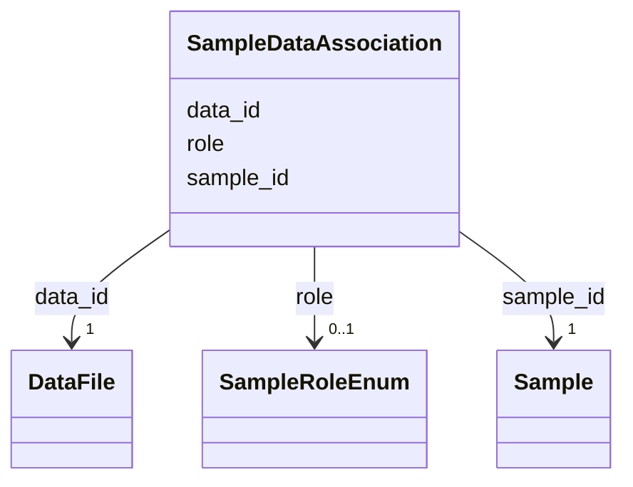

# Class: SampleDataAssociation 


_M:N link between Sample and Data with role metadata_


URI: [aimsleaf:SampleDataAssociation](https://w3id.org/aims-leaf/SampleDataAssociation)





<!-- no inheritance hierarchy -->


## Slots

| Name | Cardinality and Range | Description | Inheritance |
| ---  | --- | --- | --- |
| [sample_id](sample_id.md) | 1 <br/> [Sample](Sample.md) | Reference to the sample | direct |
| [data_id](data_id.md) | 1 <br/> [DataFile](DataFile.md) | Reference to the data | direct |
| [role](role.md) | 0..1 <br/> [SampleRoleEnum](SampleRoleEnum.md) | Role of sample in study (e | direct |


## Usages

| used by | used in | type | used |
| ---  | --- | --- | --- |
| [Dataset](Dataset.md) | [sample_datafile_associations](sample_datafile_associations.md) | range | [SampleDataAssociation](SampleDataAssociation.md) |


## Identifier and Mapping Information


### Schema Source


* from schema: https://w3id.org/aims-leaf/


## Mappings

| Mapping Type | Mapped Value |
| ---  | ---  |
| self | aimsleaf:SampleDataAssociation |
| native | aimsleaf:SampleDataAssociation |


## LinkML Source

<!-- TODO: investigate https://stackoverflow.com/questions/37606292/how-to-create-tabbed-code-blocks-in-mkdocs-or-sphinx -->

### Direct

<details>
```yaml
name: SampleDataAssociation
description: M:N link between Sample and Data with role metadata
from_schema: https://w3id.org/aims-leaf/
attributes:
  sample_id:
    name: sample_id
    description: Reference to the sample
    from_schema: https://w3id.org/aims-leaf/
    domain_of:
    - SamplePreparation
    - StudySampleAssociation
    - SampleDataAssociation
    - ExperimentSampleAssociation
    range: Sample
    required: true
  data_id:
    name: data_id
    description: Reference to the data
    from_schema: https://w3id.org/aims-leaf/
    rank: 1000
    domain_of:
    - SampleDataAssociation
    range: DataFile
    required: true
  role:
    name: role
    description: Role of sample in study (e.g., target, control, reference)
    from_schema: https://w3id.org/aims-leaf/
    domain_of:
    - StudySampleAssociation
    - SampleDataAssociation
    - ExperimentSampleAssociation
    - ExperimentInstrumentAssociation
    range: SampleRoleEnum

```
</details>

### Induced

<details>
```yaml
name: SampleDataAssociation
description: M:N link between Sample and Data with role metadata
from_schema: https://w3id.org/aims-leaf/
attributes:
  sample_id:
    name: sample_id
    description: Reference to the sample
    from_schema: https://w3id.org/aims-leaf/
    alias: sample_id
    owner: SampleDataAssociation
    domain_of:
    - SamplePreparation
    - StudySampleAssociation
    - SampleDataAssociation
    - ExperimentSampleAssociation
    range: Sample
    required: true
  data_id:
    name: data_id
    description: Reference to the data
    from_schema: https://w3id.org/aims-leaf/
    rank: 1000
    alias: data_id
    owner: SampleDataAssociation
    domain_of:
    - SampleDataAssociation
    range: DataFile
    required: true
  role:
    name: role
    description: Role of sample in study (e.g., target, control, reference)
    from_schema: https://w3id.org/aims-leaf/
    alias: role
    owner: SampleDataAssociation
    domain_of:
    - StudySampleAssociation
    - SampleDataAssociation
    - ExperimentSampleAssociation
    - ExperimentInstrumentAssociation
    range: SampleRoleEnum

```
</details>