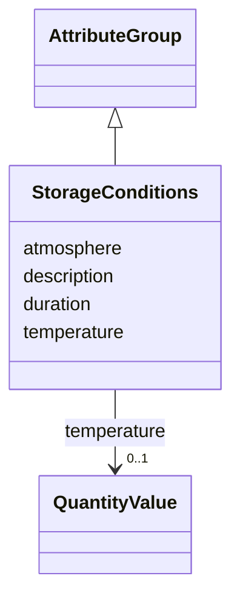

# Class: StorageConditions 


_Storage conditions for samples_


URI: [aimsleaf:StorageConditions](https://w3id.org/aims-leaf/StorageConditions)





## Inheritance
* [AttributeGroup](AttributeGroup.md)
    * **StorageConditions**


## Slots

| Name | Cardinality and Range | Description | Inheritance |
| ---  | --- | --- | --- |
| [temperature](temperature.md) | 0..1 <br/> [QuantityValue](QuantityValue.md) | Storage temperature, typically specified in degrees Celsius | direct |
| [duration](duration.md) | 0..1 <br/> [String](String.md) | Storage duration | direct |
| [atmosphere](atmosphere.md) | 0..1 <br/> [String](String.md) | Storage atmosphere conditions | direct |
| [description](description.md) | 0..1 <br/> [String](String.md) |  | [AttributeGroup](AttributeGroup.md) |


## Usages

| used by | used in | type | used |
| ---  | --- | --- | --- |
| [Sample](Sample.md) | [storage_conditions](storage_conditions.md) | range | [StorageConditions](StorageConditions.md) |
| [PlantSample](PlantSample.md) | [storage_conditions](storage_conditions.md) | range | [StorageConditions](StorageConditions.md) |


## Identifier and Mapping Information


### Schema Source


* from schema: https://w3id.org/aims-leaf/


## Mappings

| Mapping Type | Mapped Value |
| ---  | ---  |
| self | aimsleaf:StorageConditions |
| native | aimsleaf:StorageConditions |


## LinkML Source

<!-- TODO: investigate https://stackoverflow.com/questions/37606292/how-to-create-tabbed-code-blocks-in-mkdocs-or-sphinx -->

### Direct

<details>
```yaml
name: StorageConditions
description: Storage conditions for samples
from_schema: https://w3id.org/aims-leaf/
is_a: AttributeGroup
attributes:
  temperature:
    name: temperature
    description: Storage temperature, typically specified in degrees Celsius. Data
      providers may specify alternative units by including the unit in the QuantityValue.
    from_schema: https://w3id.org/aims-leaf/
    rank: 1000
    domain_of:
    - StorageConditions
    - ExperimentalConditions
    - MeasurementConditions
    - PlantSample
    range: QuantityValue
    inlined: true
  duration:
    name: duration
    description: Storage duration
    from_schema: https://w3id.org/aims-leaf/
    rank: 1000
    domain_of:
    - StorageConditions
    range: string
  atmosphere:
    name: atmosphere
    description: Storage atmosphere conditions
    from_schema: https://w3id.org/aims-leaf/
    rank: 1000
    domain_of:
    - StorageConditions
    - ExperimentalConditions
    range: string

```
</details>

### Induced

<details>
```yaml
name: StorageConditions
description: Storage conditions for samples
from_schema: https://w3id.org/aims-leaf/
is_a: AttributeGroup
attributes:
  temperature:
    name: temperature
    description: Storage temperature, typically specified in degrees Celsius. Data
      providers may specify alternative units by including the unit in the QuantityValue.
    from_schema: https://w3id.org/aims-leaf/
    rank: 1000
    alias: temperature
    owner: StorageConditions
    domain_of:
    - StorageConditions
    - ExperimentalConditions
    - MeasurementConditions
    - PlantSample
    range: QuantityValue
    inlined: true
  duration:
    name: duration
    description: Storage duration
    from_schema: https://w3id.org/aims-leaf/
    rank: 1000
    alias: duration
    owner: StorageConditions
    domain_of:
    - StorageConditions
    range: string
  atmosphere:
    name: atmosphere
    description: Storage atmosphere conditions
    from_schema: https://w3id.org/aims-leaf/
    rank: 1000
    alias: atmosphere
    owner: StorageConditions
    domain_of:
    - StorageConditions
    - ExperimentalConditions
    range: string
  description:
    name: description
    from_schema: https://w3id.org/aims-leaf/
    alias: description
    owner: StorageConditions
    domain_of:
    - NamedThing
    - AttributeGroup
    range: string

```
</details>