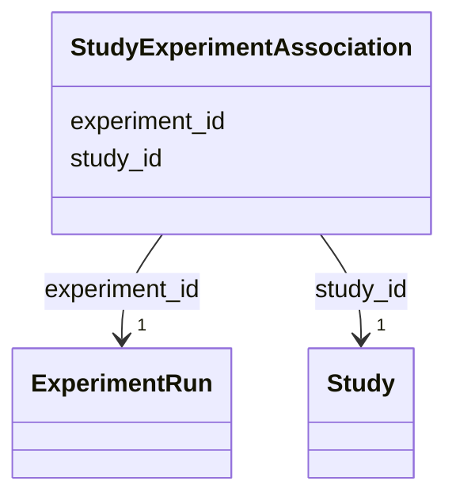

# Class: StudyExperimentAssociation 


_M:N link between Study and ExperimentRun_


URI: [aimsleaf:StudyExperimentAssociation](https://w3id.org/aims-leaf/StudyExperimentAssociation)





<!-- no inheritance hierarchy -->


## Slots

| Name | Cardinality and Range | Description | Inheritance |
| ---  | --- | --- | --- |
| [study_id](study_id.md) | 1 <br/> [Study](Study.md) | Reference to the study | direct |
| [experiment_id](experiment_id.md) | 1 <br/> [ExperimentRun](ExperimentRun.md) | Reference to the experiment run | direct |


## Usages

| used by | used in | type | used |
| ---  | --- | --- | --- |
| [Dataset](Dataset.md) | [study_experiment_associations](study_experiment_associations.md) | range | [StudyExperimentAssociation](StudyExperimentAssociation.md) |


## Identifier and Mapping Information


### Schema Source


* from schema: https://w3id.org/aims-leaf/


## Mappings

| Mapping Type | Mapped Value |
| ---  | ---  |
| self | aimsleaf:StudyExperimentAssociation |
| native | aimsleaf:StudyExperimentAssociation |


## LinkML Source

<!-- TODO: investigate https://stackoverflow.com/questions/37606292/how-to-create-tabbed-code-blocks-in-mkdocs-or-sphinx -->

### Direct

<details>
```yaml
name: StudyExperimentAssociation
description: M:N link between Study and ExperimentRun
from_schema: https://w3id.org/aims-leaf/
attributes:
  study_id:
    name: study_id
    description: Reference to the study
    from_schema: https://w3id.org/aims-leaf/
    domain_of:
    - StudySampleAssociation
    - StudyExperimentAssociation
    - StudyWorkflowAssociation
    range: Study
    required: true
  experiment_id:
    name: experiment_id
    description: Reference to the experiment run
    from_schema: https://w3id.org/aims-leaf/
    rank: 1000
    domain_of:
    - StudyExperimentAssociation
    - ExperimentSampleAssociation
    - ExperimentInstrumentAssociation
    - WorkflowExperimentAssociation
    range: ExperimentRun
    required: true

```
</details>

### Induced

<details>
```yaml
name: StudyExperimentAssociation
description: M:N link between Study and ExperimentRun
from_schema: https://w3id.org/aims-leaf/
attributes:
  study_id:
    name: study_id
    description: Reference to the study
    from_schema: https://w3id.org/aims-leaf/
    alias: study_id
    owner: StudyExperimentAssociation
    domain_of:
    - StudySampleAssociation
    - StudyExperimentAssociation
    - StudyWorkflowAssociation
    range: Study
    required: true
  experiment_id:
    name: experiment_id
    description: Reference to the experiment run
    from_schema: https://w3id.org/aims-leaf/
    rank: 1000
    alias: experiment_id
    owner: StudyExperimentAssociation
    domain_of:
    - StudyExperimentAssociation
    - ExperimentSampleAssociation
    - ExperimentInstrumentAssociation
    - WorkflowExperimentAssociation
    range: ExperimentRun
    required: true

```
</details>